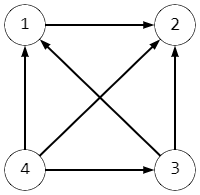
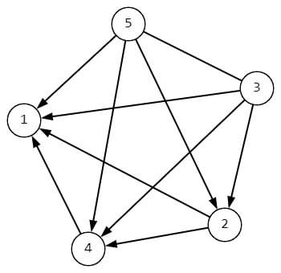

# D. Strong Vertices

**time limit per test:** 2 seconds

**memory limit per test:** 256 megabytes

**input:** standard input

**output:** standard output

Given two arrays $a$ and $b$, both of length $n$. Elements of both arrays indexed from $1$ to $n$. You are constructing a directed graph, where edge from $u$ to $v$ ($u\neq v$) exists if $a_u-a_v \ge b_u-b_v$.

A vertex $V$ is called strong if there exists a path from $V$ to all other vertices.

A path in a directed graph is a chain of several vertices, connected by edges, such that moving from the vertex $u$, along the directions of the edges, the vertex $v$ can be reached.

Your task is to find all strong vertices.

For example, if $a=[3,1,2,4]$ and $b=[4,3,2,1]$, the graph will look like this:




 The graph has only one strong vertex with number $4$

#### Input

The first line contains an integer $t$ ($1\le t\le 10^4$) — the number of test cases.

The first line of each test case contains an integer $n$ ($2 \le n \le 2\cdot 10^5$) — the length of $a$ and $b$.

The second line of each test case contains $n$ integers $a_1,a_2 \dots a_n$ ($-10^9 \le a_i \le 10^9$) — the array $a$.

The third line of each test case contains $n$ integers $b_1,b_2 \dots b_n$ ($-10^9 \le b_i \le 10^9$) — the array $b$.

It is guaranteed that the sum of $n$ for all test cases does not exceed $2\cdot 10^5$.

#### Output

For each test case, output two lines: in the first line, output the number of strong vertices, and in the second line, output all strong vertices in ascending order.

#### Example

#### Input
```
5
4
3 1 2 4
4 3 2 1
5
1 2 4 1 2
5 2 3 3 1
2
1 2
2 1
3
0 2 1
1 3 2
3
5 7 4
-2 -3 -6
```

#### Output
```
1
4 
2
3 5 
1
2 
3
1 2 3 
2
2 3 
```

#### Note

The first sample is covered in the problem statement.

For the second sample, the graph looks like this:




 The graph has two strong vertices with numbers $3$ and $5$. Note that there is a bidirectional edge between vertices $3$ and $5$.
In the third sample, the vertices are connected by a single directed edge from vertex $2$ to vertex $1$, so the only strong vertex is $2$.

In the fourth sample, all vertices are connected to each other by bidirectional edges, so there is a path from every vertex to any other vertex.
