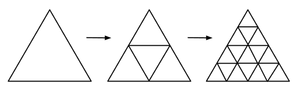

# A. Plant

**time limit per test:** 2 seconds

**memory limit per test:** 256 megabytes

**input:** stdin

**output:** stdout

Dwarfs have planted a very interesting plant, which is a triangle directed "upwards". This plant has an amusing feature. After one year a triangle plant directed "upwards" divides into four triangle plants: three of them will point "upwards" and one will point "downwards". After another year, each triangle plant divides into four triangle plants: three of them will be directed in the same direction as the parent plant, and one of them will be directed in the opposite direction. Then each year the process repeats. The figure below illustrates this process.





Help the dwarfs find out how many triangle plants that point "upwards" will be in *n* years.

#### Input

The first line contains a single integer *n* (0 ≤ *n* ≤ 10^18^) — the number of full years when the plant grew.

Please do not use the %lld specifier to read or write 64-bit integers in С++. It is preferred to use cin, cout streams or the %I64d specifier.

#### Output

Print a single integer — the remainder of dividing the number of plants that will point "upwards" in *n* years by 1000000007 (10^9^ + 7).

#### Examples

#### Input
```
1
```

#### Output
```
3
```

#### Input
```
2
```

#### Output
```
10
```

#### Note

The first test sample corresponds to the second triangle on the figure in the statement. The second test sample corresponds to the third one.
