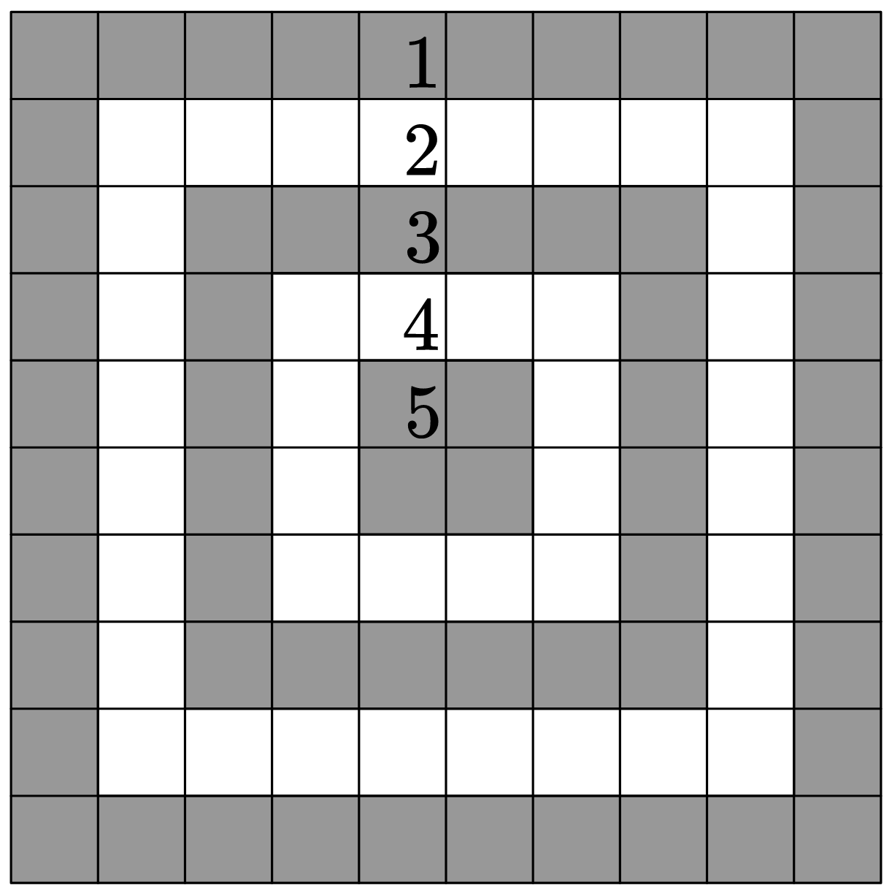

# C. Target Practice

**time limit per test:** 1 second

**memory limit per test:** 256 megabytes

**input:** standard input

**output:** standard output

A $10 \times 10$ target is made out of five "rings" as shown. Each ring has a different point value: the outermost ring — 1 point, the next ring — 2 points, ..., the center ring — 5 points.





Vlad fired several arrows at the target. Help him determine how many points he got.

#### Input

The input consists of multiple test cases. The first line of the input contains a single integer $t$ ($1 \leq t \leq 1000$) — the number of test cases.

Each test case consists of 10 lines, each containing 10 characters. Each character in the grid is either $\texttt{X}$ (representing an arrow) or $\texttt{.}$ (representing no arrow).

#### Output

For each test case, output a single integer — the total number of points of the arrows.

#### Example

#### Input
```
4
X.........
..........
.......X..
.....X....
......X...
..........
.........X
..X.......
..........
.........X
..........
..........
..........
..........
..........
..........
..........
..........
..........
..........
..........
..........
..........
..........
....X.....
..........
..........
..........
..........
..........
XXXXXXXXXX
XXXXXXXXXX
XXXXXXXXXX
XXXXXXXXXX
XXXXXXXXXX
XXXXXXXXXX
XXXXXXXXXX
XXXXXXXXXX
XXXXXXXXXX
XXXXXXXXXX
```

#### Output
```
17
0
5
220
```

#### Note

In the first test case, there are three arrows on the outer ring worth 1 point each, two arrows on the ring worth 3 points each, and two arrows on the ring worth 4 points each. The total score is $3 \times 1 + 2 \times 3 + 2 \times 4 = 17$.

In the second test case, there aren't any arrows, so the score is $0$.
