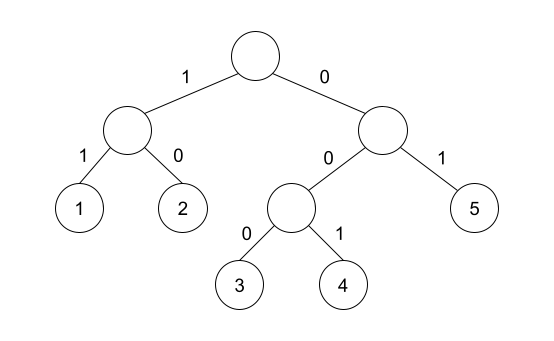

# D. 01 Tree

**time limit per test:** 1 second

**memory limit per test:** 256 megabytes

**input:** standard input

**output:** standard output

There is an edge-weighted full binary tree with $n$ leaves. A full binary tree is defined as a tree where every non-leaf vertex has exactly 2 children. For each non-leaf vertex, we label one of its children as the left child and the other as the right child.

The binary tree has a very strange property. For every non-leaf vertex, one of the edges to its children has weight $0$ while the other edge has weight $1$. Note that the edge with weight $0$ can be connected to either its left or right child.

You forgot what the tree looks like, but luckily, you still remember some information about the leaves in the form of an array $a$ of size $n$. For each $i$ from $1$ to $n$, $a_i$ represents the distance$^\dagger$ from the root to the $i$-th leaf in dfs order$^\ddagger$. Determine whether there exists a full binary tree which satisfies array $a$. Note that you do not need to reconstruct the tree.

$^\dagger$ The distance from vertex $u$ to vertex $v$ is defined as the sum of weights of the edges on the path from vertex $u$ to vertex $v$.

$^\ddagger$ The dfs order of the leaves is found by calling the following $\texttt{dfs}$ function on the root of the binary tree.
```
dfs_order = []

function dfs(v):
    if v is leaf:
        append v to the back of dfs_order
    else:
        dfs(left child of v)
        dfs(right child of v)

dfs(root)
```

#### Input

Each test contains multiple test cases. The first line contains a single integer $t$ ($1 \leq t \leq 10^4$) — the number of test cases. The description of the test cases follows.

The first line of each test case contains a single integer $n$ ($2 \le n \le 2\cdot 10^5$) — the size of array $a$.

The second line of each test case contains $n$ integers $a_1, a_2, \ldots, a_n$ ($0 \le a_i \le n - 1$) — the distance from the root to the $i$-th leaf.

It is guaranteed that the sum of $n$ over all test cases does not exceed $2\cdot 10^5$.

#### Output

For each test case, print "YES" if there exists a full binary tree which satisfies array $a$ and "NO" otherwise.

You may print each letter in any case (for example, "YES", "Yes", "yes", "yEs" will all be recognized as a positive answer).

#### Example

#### Input
```
2
5
2 1 0 1 1
5
1 0 2 1 3
```

#### Output
```
YES
NO
```

#### Note

In the first test case, the following tree satisfies the array.



In the second test case, it can be proven that there is no full binary tree that satisfies the array.
