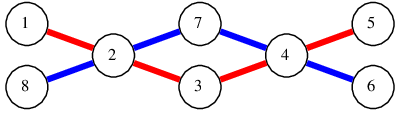

# D. Metro Scheme

**time limit per test:** 2 seconds

**memory limit per test:** 256 megabytes

**input:** stdin

**output:** stdout

Berland is very concerned with privacy, so almost all plans and blueprints are secret. However, a spy of the neighboring state managed to steal the Bertown subway scheme.

The Bertown Subway has *n* stations, numbered from 1 to *n*, and *m* bidirectional tunnels connecting them. All Bertown Subway consists of lines. To be more precise, there are two types of lines: circular and radial.

A radial line is a sequence of stations *v*~1~, ..., *v*~*k*~ (*k* > 1), where stations *v*~*i*~ and *v*~*i* + 1~ (*i* < *k*) are connected by a tunnel and no station occurs in the line more than once (*v*~*i*~ ≠ *v*~*j*~ for *i* ≠ *j*).

A loop line is a series of stations, *v*~1~, ..., *v*~*k*~ (*k* > 2), where stations *v*~*i*~ и *v*~*i* + 1~ are connected by a tunnel. In addition, stations *v*~1~ and *v*~*k*~ are also connected by a tunnel. No station is occurs in the loop line more than once.

Note that a single station can be passed by any number of lines.

According to Berland standards, there can't be more than one tunnel between two stations and each tunnel belongs to exactly one line. Naturally, each line has at least one tunnel. Between any two stations there is the way along the subway tunnels. In addition, in terms of graph theory, a subway is a vertex cactus: if we consider the subway as a graph in which the stations are the vertexes and the edges are tunnels, then each vertex lies on no more than one simple cycle.

Unfortunately, scheme, stolen by the spy, had only the stations and the tunnels. It was impossible to determine to which line every tunnel corresponds. But to sabotage successfully, the spy needs to know what minimum and maximum number of lines may be in the Bertown subway.

Help him!

#### Input

The first line contains two integers *n* and *m* (1 ≤ *n* ≤ 10^5^, 0 ≤ *m* ≤ 3·10^5^) — the number of stations and the number of tunnels, correspondingly.

Each of the next *m* lines contain two integers — the numbers of stations connected by the corresponding tunnel. The stations are numbered with integers from 1 to *n*.

It is guaranteed that the graph that corresponds to the subway has no multiple edges or loops, it is connected and it is a vertex cactus.

#### Output

Print two numbers — the minimum and maximum number of lines correspondingly.

#### Examples

#### Input
```
3 3
1 2
2 3
3 1
```

#### Output
```
1 3
```

#### Input
```
8 8
1 2
2 3
3 4
4 5
6 4
4 7
7 2
2 8
```

#### Output
```
2 8
```

#### Input
```
6 6
1 2
2 3
2 5
5 6
3 4
3 5
```

#### Output
```
3 6
```

#### Note

The subway scheme with minimum possible number of lines for the second sample is:



