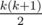
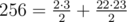

# A. Funky Numbers

**time limit per test:** 2 seconds

**memory limit per test:** 256 megabytes

**input:** stdin

**output:** stdout

As you very well know, this year's funkiest numbers are so called triangular numbers (that is, integers that are representable as



, where *k* is some positive integer), and the coolest numbers are those that are representable as a sum of two triangular numbers.

A well-known hipster Andrew adores everything funky and cool but unfortunately, he isn't good at maths. Given number *n*, help him define whether this number can be represented by a sum of two triangular numbers (not necessarily different)!

#### Input

The first input line contains an integer *n* (1 ≤ *n* ≤ 10^9^).

#### Output

Print "YES" (without the quotes), if *n* can be represented as a sum of two triangular numbers, otherwise print "NO" (without the quotes).

#### Examples

#### Input
```
256
```

#### Output
```
YES
```

#### Input
```
512
```

#### Output
```
NO
```

#### Note

In the first sample number



.

In the second sample number 512 can not be represented as a sum of two triangular numbers.
