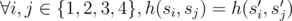

# C. Hamming Distance

**time limit per test:** 2 seconds

**memory limit per test:** 256 megabytes

**input:** stdin

**output:** stdout

Hamming distance between strings *a* and *b* of equal length (denoted by *h*(*a*, *b*)) is equal to the number of distinct integers *i* (1 ≤ *i* ≤ |*a*|), such that *a*~*i*~ ≠ *b*~*i*~, where *a*~*i*~ is the *i*-th symbol of string *a*, *b*~*i*~ is the *i*-th symbol of string *b*. For example, the Hamming distance between strings "aba" and "bba" equals 1, they have different first symbols. For strings "bbba" and "aaab" the Hamming distance equals 4.

John Doe had a paper on which four strings of equal length *s*~1~, *s*~2~, *s*~3~ and *s*~4~ were written. Each string *s*~*i*~ consisted only of lowercase letters "a" and "b". John found the Hamming distances between all pairs of strings he had. Then he lost the paper with the strings but he didn't lose the Hamming distances between all pairs.

Help John restore the strings; find some four strings *s*'~1~, *s*'~2~, *s*'~3~, *s*'~4~ of equal length that consist only of lowercase letters "a" and "b", such that the pairwise Hamming distances between them are the same as between John's strings. More formally, set *s*'~*i*~ must satisfy the condition



.

To make the strings easier to put down on a piece of paper, you should choose among all suitable sets of strings the one that has strings of minimum length.

#### Input

The first line contains space-separated integers *h*(*s*~1~, *s*~2~), *h*(*s*~1~, *s*~3~), *h*(*s*~1~, *s*~4~). The second line contains space-separated integers *h*(*s*~2~, *s*~3~) and *h*(*s*~2~, *s*~4~). The third line contains the single integer *h*(*s*~3~, *s*~4~).

All given integers *h*(*s*~*i*~, *s*~*j*~) are non-negative and do not exceed 10^5^. It is guaranteed that at least one number *h*(*s*~*i*~, *s*~*j*~) is positive.

#### Output

Print -1 if there's no suitable set of strings.

Otherwise print on the first line number *len* — the length of each string. On the *i*-th of the next four lines print string *s*'~*i*~. If there are multiple sets with the minimum length of the strings, print any of them.

#### Examples

#### Input
```
4 4 4
4 4
4
```

#### Output
```
6
aaaabb
aabbaa
bbaaaa
bbbbbb
```
