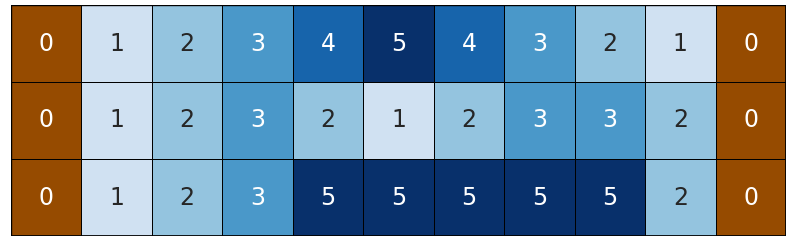
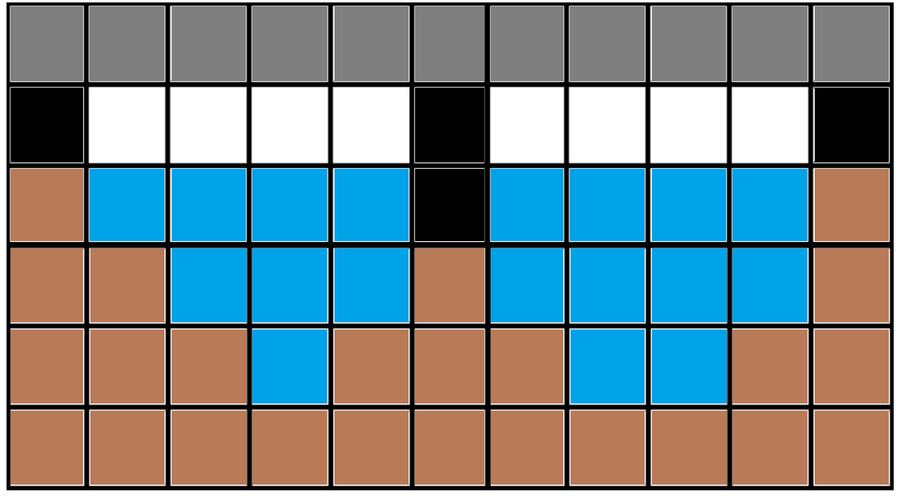

# E. Rudolf and k Bridges

**time limit per test:** 2 seconds

**memory limit per test:** 256 megabytes

**input:** standard input

**output:** standard output

Bernard loves visiting Rudolf, but he is always running late. The problem is that Bernard has to cross the river on a ferry. Rudolf decided to help his friend solve this problem.

The river is a grid of $n$ rows and $m$ columns. The intersection of the $i$-th row and the $j$-th column contains the number $a_{i,j}$ — the depth in the corresponding cell. All cells in the first and last columns correspond to the river banks, so the depth for them is $0$.




 The river may look like this.
Rudolf can choose the row $(i,1), (i,2), \ldots, (i,m)$ and build a bridge over it. In each cell of the row, he can install a support for the bridge. The cost of installing a support in the cell $(i,j)$ is $a_{i,j}+1$. Supports must be installed so that the following conditions are met:

- A support must be installed in cell $(i,1)$;
- A support must be installed in cell $(i,m)$;
- The distance between any pair of adjacent supports must be no more than $d$. The distance between supports $(i, j_1)$ and $(i, j_2)$ is $|j_1 - j_2| - 1$.

Building just one bridge is boring. Therefore, Rudolf decided to build $k$ bridges on consecutive rows of the river, that is, to choose some $i$ ($1 \le i \le n - k + 1$) and independently build a bridge on each of the rows $i, i + 1, \ldots, i + k - 1$. Help Rudolf minimize the total cost of installing supports.

#### Input

The first line contains a single integer $t$ $(1 \le t \le 10^3)$ — the number of test cases. The descriptions of the test cases follow.

The first line of each test case contains four integers $n$, $m$, $k$, and $d$ ($1 \le k \le n \le 100$, $3 \le m \le 2 \cdot 10^5$, $1 \le d \le m$) — the number of rows and columns of the field, the number of bridges, and the maximum distance between supports.

Then follow $n$ lines, $i$-th line contains $m$ positive integers $a_{i, j}$ ($0 \le a_{i, j} \le 10^6$, $a_{i, 1} = a_{i, m} = 0$) — the depths of the river cells.

It is guaranteed that the sum of $n \cdot m$ for all sets of input data does not exceed $2 \cdot 10^5$.

#### Output

For each test case, output a single number — the minimum total cost of supports installation.

#### Example

#### Input
```
5
3 11 1 4
0 1 2 3 4 5 4 3 2 1 0
0 1 2 3 2 1 2 3 3 2 0
0 1 2 3 5 5 5 5 5 2 0
4 4 2 1
0 3 3 0
0 2 1 0
0 1 2 0
0 3 3 0
4 5 2 5
0 1 1 1 0
0 2 2 2 0
0 2 1 1 0
0 3 2 1 0
1 8 1 1
0 10 4 8 4 4 2 0
4 5 3 2
0 8 4 4 0
0 3 4 8 0
0 8 1 10 0
0 10 1 5 0
```

#### Output
```
4
8
4
15
14
```

#### Note

In the first test case, it is most profitable to build a bridge on the second row.




 It is not a top view, but side view: gray cells — bridge itself, white cells are empty, black cells — supports, blue cells — water, brown cells — river bottom.
In the second test case, it is most profitable to build bridges on the second and third rows. The supports will be placed in cells $(2, 3)$, $(3, 2)$, and on the river banks.

In the third test case the supports can be placed along the river banks.
