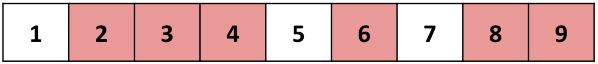
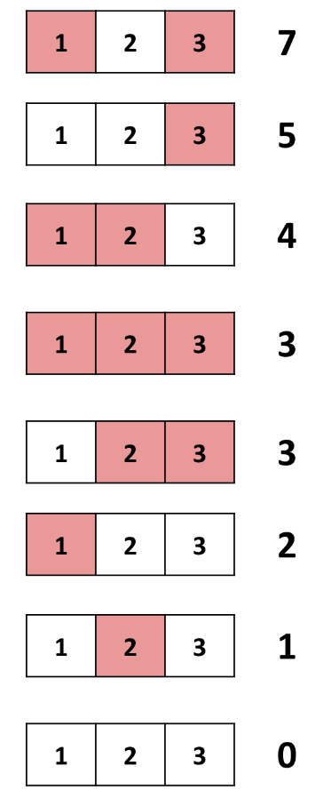

# D. Learning to Paint

**time limit per test:** 4.5 seconds

**memory limit per test:** 512 megabytes

**input:** standard input

**output:** standard output

[Pristine Beat - Touhou](<https://soundcloud.com/jackaltroy/sets/primordial-beat-pristine-beat>)

⠀

Elsie is learning how to paint. She has a canvas of $n$ cells numbered from $1$ to $n$ and can paint any (potentially empty) subset of cells.





Elsie has a 2D array $a$ which she will use to evaluate paintings. Let the maximal contiguous intervals of painted cells in a painting be $[l_1,r_1],[l_2,r_2],\ldots,[l_x,r_x]$. The beauty of the painting is the sum of $a_{l_i,r_i}$ over all $1 \le i \le x$. In the image above, the maximal contiguous intervals of painted cells are $[2,4],[6,6],[8,9]$ and the beauty of the painting is $a_{2,4}+a_{6,6}+a_{8,9}$.

There are $2^n$ ways to paint the strip. Help Elsie find the $k$ largest possible values of the beauty of a painting she can obtain, among all these ways. Note that these $k$ values do not necessarily have to be distinct. It is guaranteed that there are at least $k$ different ways to paint the canvas.

#### Input

The first line contains a single integer $t$ ($1 \leq t \leq 10^3$) — the number of test cases.

The first line of each test case contains $2$ integers $n$ and $k$ ($1 \leq n \leq 10^3$, $1 \leq k \leq \min(2^n, 5 \cdot 10^3)$) — the number of cells and the number of largest values of the beauty of a painting you must find.

The next $n$ lines of each test case describe $a$ where the $i$-th of which contains $n-i+1$ integers $a_{i,i},a_{i,i+1},\ldots,a_{i,n}$ ($-10^6 \leq a_{i,j} \leq 10^6$).

It is guaranteed the sum of $n$ over all test cases does not exceed $10^3$ and the sum of $k$ over all test cases does not exceed $5 \cdot 10^3$.

#### Output

For each test case, output $k$ integers in one line: the $i$-th of them must represent the $i$-th largest value of the beauty of a painting Elsie can obtain.

#### Example

#### Input
```
4
1 2
-5
2 4
2 -3
-1
3 8
2 4 3
1 3
5
6 20
0 -6 -3 0 -6 -2
-7 -5 -2 -3 -4
7 0 -9 -4
2 -1 1
1 -2
-6
```

#### Output
```
0 -5 
2 0 -1 -3 
7 5 4 3 3 2 1 0 
8 8 7 7 5 5 2 2 1 1 1 1 1 1 0 0 0 0 0 -1 
```

#### Note

In the first test case, Elsie can either paint the only cell or not paint it. If she paints the only cell, the beauty of the painting is $-5$. If she chooses not to paint it, the beauty of the painting is $0$. Thus, the largest beauty she can obtain is $0$ and the second largest beauty she can obtain is $-5$.

Below is an illustration of the third test case.



