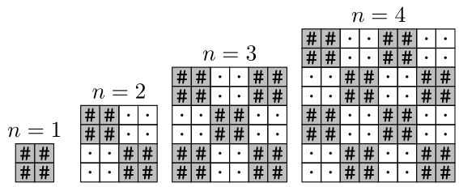

# B. Upscaling

**time limit per test:** 1 second

**memory limit per test:** 256 megabytes

**input:** standard input

**output:** standard output

You are given an integer $n$. Output a $2n \times 2n$ checkerboard made of $2 \times 2$ squares alternating '$\texttt{#}$' and '$\texttt{.}$', with the top-left cell being '$\texttt{#}$'.




The picture above shows the answers for $n=1,2,3,4$.

#### Input

The first line contains an integer $t$ ($1 \leq t \leq 20$) — the number of test cases.

The only line of each test case contains a single integer $n$ ($1 \leq n \leq 20$) — it means you need to output a checkerboard of side length $2n$.

#### Output

For each test case, output $2n$ lines, each containing $2n$ characters without spaces — the checkerboard, as described in the statement. Do not output empty lines between test cases.

#### Example

#### Input
```
4
1
2
3
4
```

#### Output
```
##
##
##..
##..
..##
..##
##..##
##..##
..##..
..##..
##..##
##..##
##..##..
##..##..
..##..##
..##..##
##..##..
##..##..
..##..##
..##..##
```
