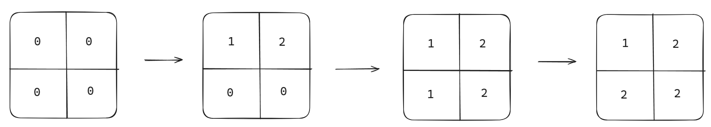

# C. Nene's Magical Matrix

**time limit per test:** 2 seconds

**memory limit per test:** 256 megabytes

**input:** standard input

**output:** standard output

The magical girl Nene has an $n\times n$ matrix $a$ filled with zeroes. The $j$-th element of the $i$-th row of matrix $a$ is denoted as $a_{i, j}$.

She can perform operations of the following two types with this matrix:

- Type $1$ operation: choose an integer $i$ between $1$ and $n$ and a permutation $p_1, p_2, \ldots, p_n$ of integers from $1$ to $n$. Assign $a_{i, j}:=p_j$ for all $1 \le j \le n$ simultaneously.
- Type $2$ operation: choose an integer $i$ between $1$ and $n$ and a permutation $p_1, p_2, \ldots, p_n$ of integers from $1$ to $n$. Assign $a_{j, i}:=p_j$ for all $1 \le j \le n$ simultaneously.

Nene wants to maximize the sum of all the numbers in the matrix $\sum\limits_{i=1}^{n}\sum\limits_{j=1}^{n}a_{i,j}$. She asks you to find the way to perform the operations so that this sum is maximized. As she doesn't want to make too many operations, you should provide a solution with no more than $2n$ operations.

A permutation of length $n$ is an array consisting of $n$ distinct integers from $1$ to $n$ in arbitrary order. For example, $[2,3,1,5,4]$ is a permutation, but $[1,2,2]$ is not a permutation ($2$ appears twice in the array), and $[1,3,4]$ is also not a permutation ($n=3$ but there is $4$ in the array).

#### Input

Each test contains multiple test cases. The first line contains the number of test cases $t$ ($1 \le t \le 500$). The description of test cases follows.

The only line of each test case contains a single integer $n$ ($1 \le n \le 500$) — the size of the matrix $a$.

It is guaranteed that the sum of $n^2$ over all test cases does not exceed $5 \cdot 10^5$.

#### Output

For each test case, in the first line output two integers $s$ and $m$ ($0\leq m\leq 2n$) — the maximum sum of the numbers in the matrix and the number of operations in your solution.

In the $k$-th of the next $m$ lines output the description of the $k$-th operation:

- an integer $c$ ($c \in \{1, 2\}$) — the type of the $k$-th operation;
- an integer $i$ ($1 \le i \le n$) — the row or the column the $k$-th operation is applied to;
- a permutation $p_1, p_2, \ldots, p_n$ of integers from $1$ to $n$ — the permutation used in the $k$-th operation.

Note that you don't need to minimize the number of operations used, you only should use no more than $2n$ operations. It can be shown that the maximum possible sum can always be obtained in no more than $2n$ operations.

#### Example

#### Input
```
2
1
2
```

#### Output
```
1 1
1 1 1
7 3
1 1 1 2
1 2 1 2
2 1 1 2
```

#### Note

In the first test case, the maximum sum $s=1$ can be obtained in $1$ operation by setting $a_{1, 1}:=1$.

In the second test case, the maximum sum $s=7$ can be obtained in $3$ operations as follows:





It can be shown that it is impossible to make the sum of the numbers in the matrix larger than $7$.
