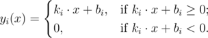

# D. Analyzing Polyline

**time limit per test:** 2 seconds

**memory limit per test:** 256 megabytes

**input:** stdin

**output:** stdout

As Valeric and Valerko were watching one of the last Euro Championship games in a sports bar, they broke a mug. Of course, the guys paid for it but the barman said that he will let them watch football in his bar only if they help his son complete a programming task. The task goes like that.

Let's consider a set of functions of the following form:



 Let's define a sum of *n* functions *y*~1~(*x*), ..., *y*~*n*~(*x*) of the given type as function *s*(*x*) = *y*~1~(*x*) + ... + *y*~*n*~(*x*) for any *x*. It's easy to show that in this case the graph *s*(*x*) is a polyline. You are given *n* functions of the given type, your task is to find the number of angles that do not equal 180 degrees, in the graph *s*(*x*), that is the sum of the given functions.
Valeric and Valerko really want to watch the next Euro Championship game, so they asked you to help them.

#### Input

The first line contains integer *n* (1 ≤ *n* ≤ 10^5^) — the number of functions. Each of the following *n* lines contains two space-separated integer numbers *k*~*i*~, *b*~*i*~ ( - 10^9^ ≤ *k*~*i*~, *b*~*i*~ ≤ 10^9^) that determine the *i*-th function.

#### Output

Print a single number — the number of angles that do not equal 180 degrees in the graph of the polyline that equals the sum of the given functions.

#### Examples

#### Input
```
1
1 0
```

#### Output
```
1
```

#### Input
```
3
1 0
0 2
-1 1
```

#### Output
```
2
```

#### Input
```
3
-2 -4
1 7
-5 1
```

#### Output
```
3
```
