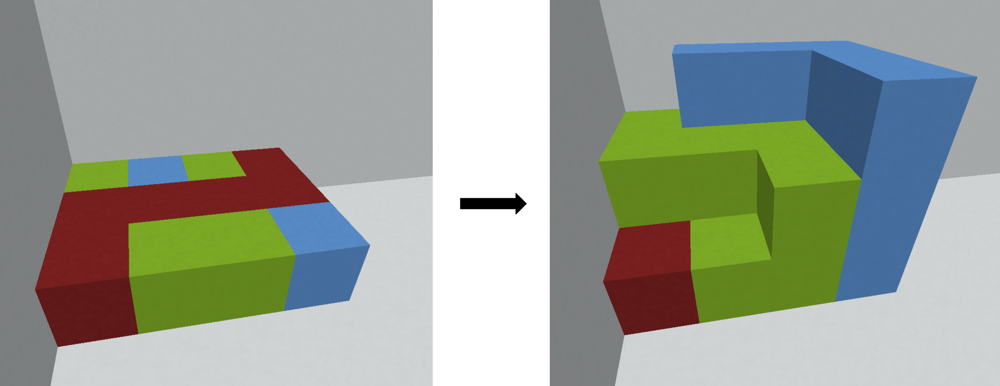

# E. Connected Cubes

**time limit per test:** 4 seconds

**memory limit per test:** 256 megabytes

**input:** standard input

**output:** standard output

There are $n \cdot m$ unit cubes currently in positions $(1, 1, 1)$ through $(n, m, 1)$. Each of these cubes is one of $k$ colors. You want to add additional cubes at any integer coordinates such that the subset of cubes of each color is connected, where two cubes are considered connected if they share a face.

In other words, for every pair of cubes of the same color $c$, it should be possible to travel from one to the other, moving only through cubes of color $c$ that share a face.

The existing cubes are currently in the corner of a room. There are colorless cubes completely filling the planes $x = 0$, $y = 0$, and $z = 0$, preventing you from placing additional cubes there or at any negative coordinates.





Find a solution that uses at most $4 \cdot 10^5$ additional cubes (not including the cubes that are currently present), or determine that there is no solution. It can be shown that under the given constraints, if there is a solution, there is one using at most $4 \cdot 10^5$ additional cubes.

#### Input

The first line of the input contains three integers $n$, $m$, and $k$ ($2 \le n, m, k \le 50$) — the number of rows and columns of cubes, and the number of colors, respectively.

The $i$-th of the next $n$ lines contains $m$ integers. The $j$-th of these is $a_{ij}$ ($1 \le a_{ij} \le k$) — the color of the cube at position $(i, j, 1)$. For every color from $1$ to $k$, it is guaranteed that there is at least one cube in the input of that color.

#### Output

If there is no solution, print a single integer $-1$.

Otherwise, the first line of output should contain a single integer $p$ ($0 \le p \le 4 \cdot 10^5$) — the number of additional cubes you will add.

The next $p$ lines should contain four integers $x$, $y$, $z$ and $c$ ($1 \le x, y, z \le 10^6$, $1 \le c \le k$) — indicating that you are adding a cube with color $c$ at position $(x, y, z)$.

No two cubes in the output should have the same coordinates, and no cube in the output should have the same coordinates as any cube in the input.

If there are multiple solutions, print any.

#### Examples

#### Input
```
3 4 3
3 2 3 1
1 1 1 1
1 3 3 2
```

#### Output
```
13
1 1 2 3
1 3 2 3
2 1 2 3
2 2 2 3
2 3 2 3
3 3 2 3
1 2 2 2
1 2 3 2
1 3 3 2
1 4 3 2
2 4 3 2
3 4 3 2
3 4 2 2
```

#### Input
```
2 2 2
2 1
1 2
```

#### Output
```
9
1 3 1 1
2 3 1 1
3 1 1 1
3 2 1 1
3 3 1 1
1 1 2 2
1 2 2 2
2 1 2 2
2 2 2 2
```

#### Note

The image in the statement corresponds to the first example case, with $\text{red} = 1$, $\text{blue} = 2$, $\text{green} = 3$.
