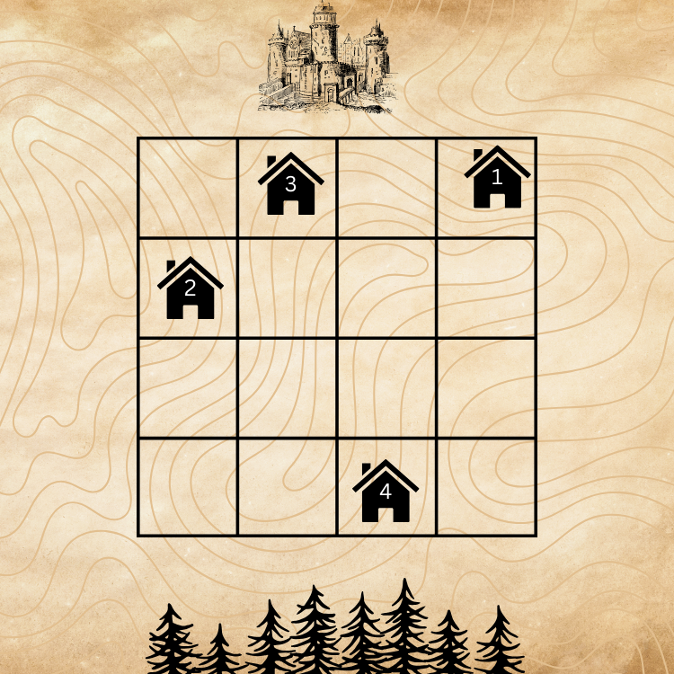

# B1. Exact Neighbours (Easy)

**time limit per test:** 2 seconds

**memory limit per test:** 256 megabytes

**input:** standard input

**output:** standard output

The only difference between this and the hard version is that all $a_{i}$ are even.

After some recent attacks on Hogwarts Castle by the Death Eaters, the Order of the Phoenix has decided to station $n$ members in Hogsmead Village. The houses will be situated on a picturesque $n\times n$ square field. Each wizard will have their own house, and every house will belong to some wizard. Each house will take up the space of one square.

However, as you might know wizards are very superstitious. During the weekends, each wizard $i$ will want to visit the house that is exactly $a_{i}$ $(0 \leq a_{i} \leq n)$ away from their own house. The roads in the village are built horizontally and vertically, so the distance between points $(x_{i}, y_{i})$ and $(x_{j}, y_{j})$ on the $n\times n$ field is $ |x_{i} - x_{j}| + |y_{i} - y_{j}|$. The wizards know and trust each other, so one wizard can visit another wizard's house when the second wizard is away. The houses to be built will be big enough for all $n$ wizards to simultaneously visit any house.

Apart from that, each wizard is mandated to have a view of the Hogwarts Castle in the north and the Forbidden Forest in the south, so the house of no other wizard should block the view. In terms of the village, it means that in each column of the $n\times n$ field, there can be at most one house, i.e. if the $i$-th house has coordinates $(x_{i}, y_{i})$, then $x_{i} \neq x_{j}$ for all $i \neq j$.

The Order of the Phoenix doesn't yet know if it is possible to place $n$ houses in such a way that will satisfy the visit and view requirements of all $n$ wizards, so they are asking for your help in designing such a plan.

If it is possible to have a correct placement, where for the $i$-th wizard there is a house that is $a_{i}$ away from it and the house of the $i$-th wizard is the only house in their column, output YES, the position of houses for each wizard, and to the house of which wizard should each wizard go during the weekends.

If it is impossible to have a correct placement, output NO.

#### Input

The first line contains $n$ ($2 \leq n \leq 2\cdot 10^{5}$), the number of houses to be built.

The second line contains $n$ integers $a_{1}, \ldots, a_{n}$ $(0 \leq a_{i} \leq n)$. All $a_{i}$ are even.

#### Output

If there exists such a placement, output YES on the first line; otherwise, output NO.

If the answer is YES, output $n + 1$ more lines describing the placement.

The next $n$ lines should contain the positions of the houses $1 \leq x_{i}, y_{i} \leq n$ for each wizard.

The $i$-th element of the last line should contain the index of the wizard, the house of which is exactly $a_{i}$ away from the house of the $i$-th wizard. If there are multiple such wizards, you can output any.

If there are multiple house placement configurations, you can output any.

#### Example

#### Input
```
4
0 4 2 4
```

#### Output
```
YES
4 4
1 3
2 4
3 1
1 1 1 3
```

#### Note

For the sample, the house of the 1st wizard is located at $(4, 4)$, of the 2nd at $(1, 3)$, of the 3rd at $(2, 4)$, of the 4th at $(3, 1)$.

The distance from the house of the 1st wizard to the house of the 1st wizard is $|4 - 4| + |4 - 4| = 0$.

The distance from the house of the 2nd wizard to the house of the 1st wizard is $|1 - 4| + |3 - 4| = 4$.

The distance from the house of the 3rd wizard to the house of the 1st wizard is $|2 - 4| + |4 - 4| = 2$.

The distance from the house of the 4th wizard to the house of the 3rd wizard is $|3 - 2| + |1 - 4| = 4$.

The view and the distance conditions are satisfied for all houses, so the placement is correct.



