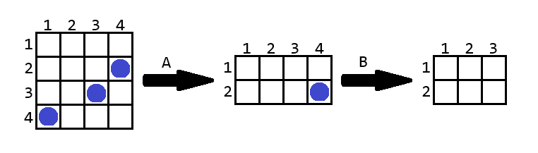

# F. Cutting Game

**time limit per test:** 3 seconds

**memory limit per test:** 256 megabytes

**input:** standard input

**output:** standard output

Alice and Bob were playing a game again. They have a grid of size $a \times b$ ($1 \le a, b \le 10^9$), on which there are $n$ chips, with at most one chip in each cell. The cell at the intersection of the $x$-th row and the $y$-th column has coordinates $(x, y)$.

Alice made the first move, and the players took turns. On each move, a player could cut several (but not all) rows or columns from the beginning or end of the remaining grid and earn a point for each chip that was on the cut part of the grid. Each move can be described by the character 'U', 'D', 'L', or 'R' and an integer $k$:

- If the character is 'U', then the first $k$ remaining rows will be cut;
- If the character is 'D', then the last $k$ remaining rows will be cut;
- If the character is 'L', then the first $k$ remaining columns will be cut;
- If the character is 'R', then the last $k$ remaining columns will be cut.

Based on the initial state of the grid and the players' moves, determine the number of points earned by Alice and Bob, respectively.

#### Input

The first line contains a single integer $t$ ($1 \le t \le 10^4$) — the number of test cases.

The first line of each test case contains four integers $a$, $b$, $n$, and $m$ ($2 \le a, b \le 10^9$, $1 \le n, m \le 2 \cdot 10^5$) — the dimensions of the grid, the number of chips, and the number of moves.

Each of the next $n$ lines contain two integers $x_i$ and $y_i$ ($1 \le x_i \le a$, $1 \le y_i \le b$) — the coordinates of the chips. All pairs of coordinates are distinct.

Each of the next $m$ lines contain a character $c_j$ and an integer $k_j$ — the description of the $j$-th move. It is guaranteed that $k$ is less than the number of rows/columns in the current grid. In other words, a player cannot cut the entire remaining grid on their move.

It is guaranteed that the sum of the values of $n$ across all test cases in the test does not exceed $2 \cdot 10^5$. It is guaranteed that the sum of the values of $m$ across all test cases in the test does not exceed $2 \cdot 10^5$.

#### Output

For each test case, output two integers — the number of points earned by Alice and Bob, respectively.

#### Example

#### Input
```
6
4 4 3 2
4 1
3 3
2 4
D 2
R 1
4 4 3 3
4 1
3 2
2 3
D 1
L 1
U 2
3 5 3 2
1 3
2 2
3 3
R 2
R 2
6 4 4 2
1 4
2 3
5 3
1 1
R 1
U 1
9 3 2 1
6 1
3 3
D 8
10 10 2 5
7 5
9 1
R 1
L 2
D 1
U 4
D 1
```

#### Output
```
2 1
2 0
0 3
1 1
2 0
0 1
```

#### Note

Below is the game from the first example:





On her turn, Alice cut $2$ rows from the bottom and scored $2$ points, then Bob cut $1$ column from the right and scored one point. Note that if Bob had cut $1$ row from the bottom, he would have also scored $1$ point.
