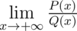
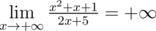
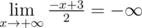
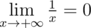
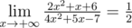
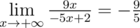

# B. Limit

**time limit per test:** 2 seconds

**memory limit per test:** 256 megabytes

**input:** stdin

**output:** stdout

You are given two polynomials:

- *P*(*x*) = *a*~0~·*x*^*n*^ + *a*~1~·*x*^*n* - 1^ + ... + *a*~*n* - 1~·*x* + *a*~*n*~ and
- *Q*(*x*) = *b*~0~·*x*^*m*^ + *b*~1~·*x*^*m* - 1^ + ... + *b*~*m* - 1~·*x* + *b*~*m*~.

Calculate limit


.

#### Input

The first line contains two space-separated integers *n* and *m* (0 ≤ *n*, *m* ≤ 100) — degrees of polynomials *P*(*x*) and *Q*(*x*) correspondingly.

The second line contains *n* + 1 space-separated integers — the factors of polynomial *P*(*x*): *a*~0~, *a*~1~, ..., *a*~*n* - 1~, *a*~*n*~ ( - 100 ≤ *a*~*i*~ ≤ 100, *a*~0~ ≠ 0).

The third line contains *m* + 1 space-separated integers — the factors of polynomial *Q*(*x*): *b*~0~, *b*~1~, ..., *b*~*m* - 1~, *b*~*m*~ ( - 100 ≤ *b*~*i*~ ≤ 100, *b*~0~ ≠ 0).

#### Output

If the limit equals  + ∞, print "Infinity" (without quotes). If the limit equals  - ∞, print "-Infinity" (without the quotes).

If the value of the limit equals zero, print "0/1" (without the quotes).

Otherwise, print an irreducible fraction — the value of limit



, in the format "p/q" (without the quotes), where *p* is the — numerator, *q* (*q* > 0) is the denominator of the fraction.

#### Examples

#### Input
```
2 1
1 1 1
2 5
```

#### Output
```
Infinity
```

#### Input
```
1 0
-1 3
2
```

#### Output
```
-Infinity
```

#### Input
```
0 1
1
1 0
```

#### Output
```
0/1
```

#### Input
```
2 2
2 1 6
4 5 -7
```

#### Output
```
1/2
```

#### Input
```
1 1
9 0
-5 2
```

#### Output
```
-9/5
```

#### Note

Let's consider all samples:

-




-




-




-




-




You can learn more about the definition and properties of limits if you follow the link: http://en.wikipedia.org/wiki/Limit_of_a_function
