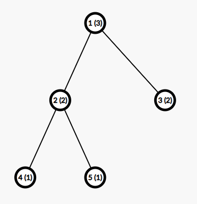
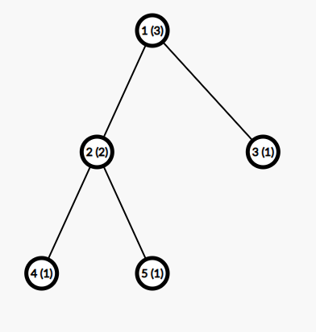
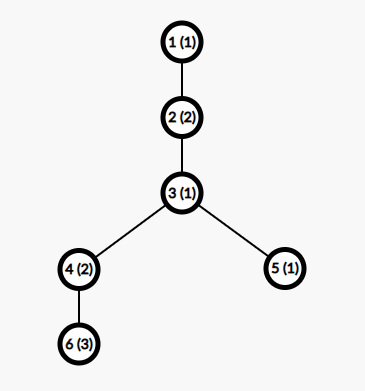

# F. Turtle and Paths on a Tree

**time limit per test:** 4 seconds

**memory limit per test:** 1024 megabytes

**input:** standard input

**output:** standard output

Note the unusual definition of $\text{MEX}$ in this problem.

Piggy gave Turtle a binary tree$^{\dagger}$ with $n$ vertices and a sequence $a_1, a_2, \ldots, a_n$ on his birthday. The binary tree is rooted at vertex $1$.

If a set of paths $P = \{(x_i, y_i)\}$ in the tree covers each edge exactly once, then Turtle will think that the set of paths is good. Note that a good set of paths can cover a vertex twice or more.

Turtle defines the value of a set of paths as $\sum\limits_{(x, y) \in P} f(x, y)$, where $f(x, y)$ denotes the $\text{MEX}^{\ddagger}$ of all $a_u$ such that vertex $u$ is on the simple path from $x$ to $y$ in the tree (including the starting vertex $x$ and the ending vertex $y$).

Turtle wonders the minimum value over all good sets of paths. Please help him calculate the answer!

$^{\dagger}$A binary tree is a tree where every non-leaf vertex has at most $2$ sons.

$^{\ddagger}\text{MEX}$ of a collection of integers $c_1, c_2, \ldots, c_k$ is defined as the smallest positive integer $x$ which does not occur in the collection $c$. For example, $\text{MEX}$ of $[3, 3, 1, 4]$ is $2$, $\text{MEX}$ of $[2, 3]$ is $1$.

#### Input

Each test contains multiple test cases. The first line contains the number of test cases $t$ ($1 \le t \le 10^4$). The description of the test cases follows.

The first line of each test case contains a single integer $n$ ($2 \le n \le 2.5 \cdot 10^4$) — the number of vertices in the tree.

The second line of each test case contains $n$ integers $a_1, a_2, \ldots, a_n$ ($1 \le a_i \le 10^9$) — the elements of the sequence $a$.

The third line of each test case contains $n - 1$ integers $p_2, p_3, \ldots, p_n$ ($1 \le p_i \lt i$) — the parent of each vertex in the tree.

Additional constraint on the input: the given tree is a binary tree, that is, every non-leaf vertex has at most $2$ sons.

It is guaranteed that the sum of $n$ over all test cases does not exceed $10^5$.

#### Output

For each test case, output a single integer — the minimum value over all good sets of paths.

#### Example

#### Input
```
5
5
3 2 2 1 1
1 1 2 2
5
3 2 1 1 1
1 1 2 2
6
1 2 1 2 1 3
1 2 3 3 4
7
2 1 2 3 1 2 1
1 1 2 2 3 3
10
1 2 2 1 4 2 3 1 2 1
1 1 2 2 3 3 4 5 5
```

#### Output
```
4
6
6
6
7
```

#### Note

In the first test case, the tree is as follows. The number in brackets denotes the weight of the vertex:





The good set of paths with the minimum value is $\{(2, 3), (4, 5)\}$.

Note that in this test case $\{(4, 5)\}$ and $\{(3, 4), (4, 5)\}$ are not good sets of paths because each edge should be covered exactly once.

In the second test case, the tree is as follows:





The set of good paths with the minimum value is $\{(1, 2), (1, 3), (4, 5)\}$.

In the third test case, the tree is as follows:





The set of good paths with the minimum value is $\{(1, 6), (3, 5)\}$.
