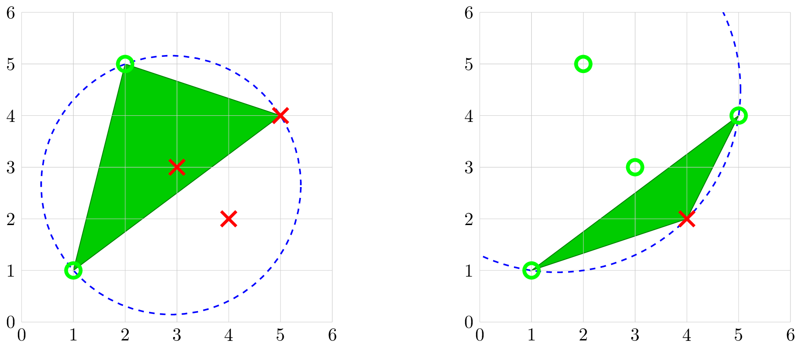

# H. Tower Capturing

**time limit per test:** 2 seconds

**memory limit per test:** 256 megabytes

**input:** standard input

**output:** standard output

There are $n$ towers at $n$ distinct points $(x_1, y_1), (x_2, y_2), \ldots, (x_n, y_n)$, such that no three are collinear and no four are concyclic. Initially, you own towers $(x_1, y_1)$ and $(x_2, y_2)$, and you want to capture all of them. To do this, you can do the following operation any number of times:

- Pick two towers $P$ and $Q$ you own and one tower $R$ you don't own, such that the circle through $P$, $Q$, and $R$ contains all $n$ towers inside of it.
- Afterwards, capture all towers in or on triangle $\triangle PQR$, including $R$ itself.
 An attack plan is a series of choices of $R$ ($R_1, R_2, \ldots, R_k$) using the above operations after which you capture all towers. Note that two attack plans are considered different only if they differ in their choice of $R$ in some operation; in particular, two attack plans using the same choices of $R$ but different choices of $P$ and $Q$ are considered the same.
Count the number of attack plans of minimal length. Note that it might not be possible to capture all towers, in which case the answer is $0$.

Since the answer may be large, output it modulo $998\,244\,353$.

#### Input

The first line contains a single integer $t$ ($1 \leq t \leq 250$) — the number of test cases.

The first line of each test case contains a single integer $n$ ($4 \leq n \leq 100$) — the number of towers.

The $i$-th of the next $n$ lines contains two integers $x_i$ and $y_i$ ($-10^4 \leq x_i, y_i \leq 10^4$) — the location of the $i$-th tower. Initially, you own towers $(x_1, y_1)$ and $(x_2, y_2)$.

All towers are at distinct locations, no three towers are collinear, and no four towers are concyclic.

The sum of $n$ over all test cases does not exceed $1000$.

#### Output

For each test case, output a single integer — the number of attack plans of minimal length after which you capture all towers, modulo $998\,244\,353$.

#### Example

#### Input
```
3
5
1 1
2 5
3 3
4 2
5 4
6
1 1
3 3
1 2
2 1
3 10000
19 84
7
2 7
-4 -3
-3 6
3 1
-5 2
1 -4
-1 7
```

#### Output
```
1
0
10
```

#### Note

In the first test case, there is only one possible attack plan of shortest length, shown below.





- Use the operation with $P =$ tower $1$, $Q =$ tower $2$, and $R =$ tower $5$. The circle through these three towers contains all towers inside of it, and as a result towers $3$ and $5$ are captured.
- Use the operation with $P =$ tower $5$, $Q =$ tower $1$, and $R =$ tower $4$. The circle through these three towers contains all towers inside of it, and as a result tower $4$ is captured.

In the second case, for example, you can never capture the tower at $(3, 10\,000)$.
