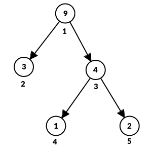

# E. Wonderful Tree!

**time limit per test:** 2 seconds

**memory limit per test:** 256 megabytes

**input:** standard input

**output:** standard output

God's Blessing on This ArrayForces!

A Random Pebble

You are given a tree with $n$ vertices, rooted at vertex $1$. The $i$-th vertex has an integer $a_i$ written on it.

Let $L$ be the set of all direct children$^{\text{∗}}$ of $v$. A tree is called wonderful, if for all vertices $v$ where $L$ is not empty, $$a_v \le \sum_{u \in L}{a_u}.$$ In one operation, you choose any vertex $v$ and increase $a_v$ by $1$.

Find the minimum number of operations needed to make the given tree wonderful!

$^{\text{∗}}$ Vertex $u$ is called a direct child of vertex $v$ if:

- $u$ and $v$ are connected by an edge, and
- $v$ is on the (unique) path from $u$ to the root of the tree.

#### Input

Each test contains multiple test cases. The first line of input contains a single integer $t$ ($1 \le t \le 1000$) — the number of test cases. The description of the test cases follows.

The first line of each test case contains a single integer $n$ ($2 \le n \le 5000$) — the number of vertices in the tree.

The second line of each test case contains $n$ integers $a_1, a_2, \ldots, a_n$ ($0 \le a_i \le 10^9$) — the values initially written on the vertices.

The third line of each test case contains $n - 1$ integers $p_2, p_3 , \ldots, p_n$ ($1 \le p_i \lt i$), indicating that there is an edge from vertex $p_i$ to vertex $i$. It is guaranteed that the given edges form a tree.

It is guaranteed that the sum of $n$ over all test cases does not exceed $5000$.

#### Output

For each test case, output a single integer — the minimum number of operations needed to make the tree wonderful.

#### Example

#### Input
```
4
5
9 3 4 1 2
1 1 3 3
2
5 3
1
2
36 54
1
3
0 0 0
1 2
```

#### Output
```
3
2
0
0
```

#### Note

The tree in the first test case:





You can apply the operation once on vertex $5$ and twice on vertex $2$ to get a wonderful tree.

In the second test case, you can apply the operation twice on vertex $2$ to get a wonderful tree.

In the third and fourth test cases, the tree is already wonderful, so you don't need to apply any operations.
