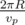

# C. Delivering Carcinogen

**time limit per test:** 2 seconds

**memory limit per test:** 256 megabytes

**input:** stdin

**output:** stdout

Qwerty the Ranger arrived to the Diatar system with a very important task. He should deliver a special carcinogen for scientific research to planet Persephone. This is urgent, so Qwerty has to get to the planet as soon as possible. A lost day may fail negotiations as nobody is going to pay for an overdue carcinogen.

You can consider Qwerty's ship, the planet Persephone and the star Diatar points on a plane. Diatar is located in the origin of coordinate axes — at point (0, 0). Persephone goes round Diatar along a circular orbit with radius *R* in the counter-clockwise direction at constant linear speed *v*~*p*~ (thus, for instance, a full circle around the star takes



 of time). At the initial moment of time Persephone is located at point (*x*~*p*~, *y*~*p*~).

At the initial moment of time Qwerty's ship is at point (*x*, *y*). Qwerty can move in any direction at speed of at most *v* (*v* > *v*~*p*~). The star Diatar is hot (as all stars), so Qwerty can't get too close to it. The ship's metal sheathing melts at distance *r* (*r* < *R*) from the star.

Find the minimum time Qwerty needs to get the carcinogen to planet Persephone.

#### Input

The first line contains space-separated integers *x*~*p*~, *y*~*p*~ and *v*~*p*~ ( - 10^4^ ≤ *x*~*p*~, *y*~*p*~ ≤ 10^4^, 1 ≤ *v*~*p*~ < 10^4^) — Persephone's initial position and the speed at which it goes round Diatar.

The second line contains space-separated integers *x*, *y*, *v* and *r* ( - 10^4^ ≤ *x*, *y* ≤ 10^4^, 1 < *v* ≤ 10^4^, 1 ≤ *r* ≤ 10^4^) — The intial position of Qwerty's ship, its maximum speed and the minimum safe distance to star Diatar.

It is guaranteed that *r*^2^ < *x*^2^ + *y*^2^, *r*^2^ < *x*~*p*~^2^ + *y*~*p*~^2^ and *v*~*p*~ < *v*.

#### Output

Print a single real number — the minimum possible delivery time. The answer will be considered valid if its absolute or relative error does not exceed 10^ - 6^.

#### Examples

#### Input
```
10 0 1
-10 0 2 8
```

#### Output
```
9.584544103
```

#### Input
```
50 60 10
50 60 20 40
```

#### Output
```
0.000000000
```
