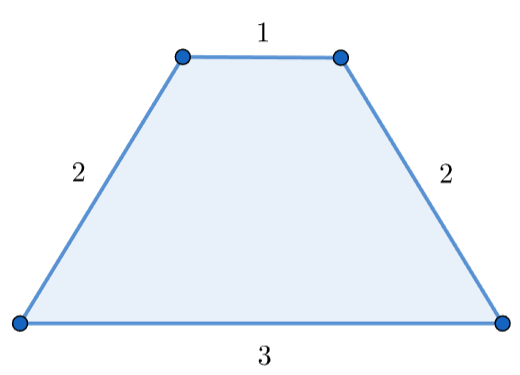

# F. Polygonal Segments

**time limit per test:** 8 seconds

**memory limit per test:** 512 megabytes

**input:** standard input

**output:** standard output

You are given an array $a$ of size $n$.

A segment $[l, r](1 \le l \lt r \le n)$ is called a polygonal segment only if the following conditions hold:

- $(r-l+1) \geq 3$;
- Considering $a_l, a_{l+1}, \ldots, a_r$ as side lengths, these sides can form a polygon with $(r-l+1)$ sides.

Process $q$ queries of two types:

- "1 l r": find the length of the longest segment among all polygonal segments $[l_0,r_0]$ satisfying $l \le l_0 \le r_0 \le r$. If there is no such polygonal segment, output $-1$ instead;
- "2 i x": assign $a_i := x$.

#### Input

The first line contains an integer $t$ ($1 \leq t \leq 10^4$) — the number of test cases.

For each test case:

- The first line of each testcase contains two integers $n$, $q$ ($4 \le n \le 2\cdot 10^5$, $1 \le q \le 10^5$);
- The second line of each testcase contains $n$ integers $a_1,a_2,\ldots, a_n$ ($1 \le a_i \le 10^{12}$);
- The following $q$ lines contain the description of queries. Each line is of one of two types:

 - "1 l r" ($1 \le l \lt r \le n$, $r-l+1\ge 3$);
 - "2 i x" ($1 \le i \le n$, $1 \le x \le 10^{12}$).


It is guaranteed that the sum of $n$ over all test cases will not exceed $2 \cdot 10^5$, and the sum of $q$ over all test cases will not exceed $10^5$.

#### Output

For each query, if there is no suitable segment, output $-1$ in a new line. Otherwise, output the length of the longest segment satisfying the condition above in a new line.

#### Example

#### Input
```
2
5 6
3 1 2 2 8
1 1 3
1 1 4
1 1 5
2 1 5
1 1 4
1 1 5
4 10
500000000000 500000000000 1000000000000 500000000000
1 1 3
1 2 4
1 1 4
2 1 499999999999
2 3 999999999999
1 1 3
1 2 4
1 1 4
2 3 1000000000000
1 1 3
```

#### Output
```
-1
4
4
3
5
-1
-1
4
-1
3
4
-1
```

#### Note

In the first query of the first test case, there is no polygonal segment under the given condition. For example, considering segment $[1,3]$, you can not form a triangle with side lengths of $a_1=3$, $a_2=1$, and $a_3=2$.

In the second query of the first test case, the longest polygonal segment is $[1,4]$. You can form a quadrilateral with side lengths of $a_1=3$, $a_2=1$, $a_3=2$, and $a_4=2$.




 An example of a quadrilateral with side lengths of $3$, $1$, $2$, and $2$.
