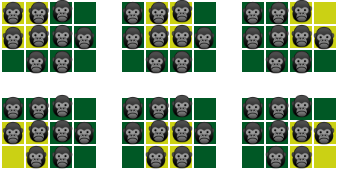

# E. Photoshoot for Gorillas

**time limit per test:** 2 seconds

**memory limit per test:** 256 megabytes

**input:** standard input

**output:** standard output

You really love gorillas, so you decided to organize a photoshoot for them. Gorillas live in the jungle. The jungle is represented as a grid of $n$ rows and $m$ columns. $w$ gorillas agreed to participate in the photoshoot, and the gorilla with index $i$ ($1 \le i \le w$) has a height of $a_i$. You want to place all the gorillas in the cells of the grid such that there is no more than one gorilla in each cell.

The spectacle of the arrangement is equal to the sum of the spectacles of all sub-squares of the grid with a side length of $k$.

The spectacle of a sub-square is equal to the sum of the heights of the gorillas in it.

From all suitable arrangements, choose the arrangement with the maximum spectacle.

#### Input

The first line contains an integer $t$ ($1 \le t \le 10^3$) — the number of test cases.

The descriptions of the test cases follow.

The first line contains integers $n$, $m$, $k$ ($1 \le n, m \le 2 \cdot 10^5$, $1 \le n \cdot m \le 2 \cdot 10^5$, $1 \le k \le \min(n, m)$) — the dimensions of the grid and the side length of the square.

The second line contains an integer $w$ ($1 \le w \le n \cdot m$) — the number of gorillas.

The third line contains $w$ integers $a_1, a_2, \ldots, a_w$ ($1 \le a_i \le 10^9$) — the heights of the gorillas.

It is guaranteed that the sum of $n \cdot m$ across all test cases does not exceed $2 \cdot 10^5$. The same guarantee applies to $w$.

#### Output

For each test case, output a single integer — the maximum spectacle of a suitable arrangement.

#### Example

#### Input
```
5
3 4 2
9
1 1 1 1 1 1 1 1 1
2 1 1
2
5 7
20 15 7
9
4 1 4 5 6 1 1000000000 898 777
1984 1 1
4
5 4 1499 2004
9 5 5
6
6 7 14 16 16 6
```

#### Output
```
21
12
49000083104
3512
319
```

#### Note

In the first test case of the first input set, the spectacle of the following sub-squares is summed:




 Yellow color corresponds to the sub-squares, green — to the rest of the grid squares.
The picture shows the optimal arrangement of the gorillas. The spectacle of the arrangement is $4 + 4 + 3 + 3 + 4 + 3 = 21$.
