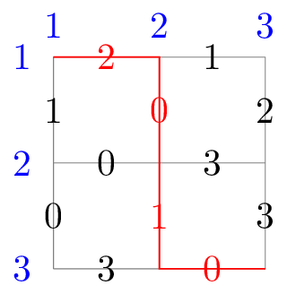
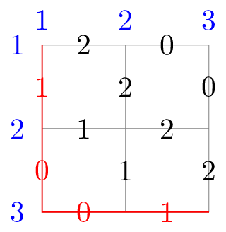

# G. Lattice Optimizing

**time limit per test:** 7 seconds

**memory limit per test:** 1024 megabytes

**input:** standard input

**output:** standard output

Consider a grid graph with $n$ rows and $n$ columns. Let the cell in row $x$ and column $y$ be $(x,y)$. There exists a directed edge from $(x,y)$ to $(x+1,y)$, with non-negative integer value $d_{x,y}$, for all $1\le x \lt n, 1\le y \le n$, and there also exists a directed edge from $(x,y)$ to $(x,y+1)$, with non-negative integer value $r_{x,y}$, for all $1\le x \le n, 1\le y \lt n$.

Initially, you are at $(1,1)$, with an empty set $S$. You need to walk along the edges and eventually reach $(n,n)$. Whenever you pass an edge, its value will be inserted into $S$. Please maximize the MEX$^{\text{∗}}$ of $S$ when you reach $(n,n)$.

$^{\text{∗}}$The MEX (minimum excluded) of an array is the smallest non-negative integer that does not belong to the array. For instance:

- The MEX of $[2,2,1]$ is $0$, because $0$ does not belong to the array.
- The MEX of $[3,1,0,1]$ is $2$, because $0$ and $1$ belong to the array, but $2$ does not.
- The MEX of $[0,3,1,2]$ is $4$, because $0, 1, 2$, and $3$ belong to the array, but $4$ does not.

#### Input

Each test contains multiple test cases. The first line contains the number of test cases $t$ ($1\le t\le100$). The description of the test cases follows.

The first line of each test case contains a single integer $n$ ($2\le n\le20$) — the number of rows and columns.

Each of the next $n-1$ lines contains $n$ integers separated by single spaces — the matrix $d$ ($0\le d_{x,y}\le 2n-2$).

Each of the next $n$ lines contains $n-1$ integers separated by single spaces — the matrix $r$ ($0\le r_{x,y}\le 2n-2$).

It is guaranteed that the sum of all $n^3$ does not exceed $8000$.

#### Output

For each test case, print a single integer — the maximum MEX of $S$ when you reach $(n,n)$.

#### Examples

#### Input
```
2
3
1 0 2
0 1 3
2 1
0 3
3 0
3
1 2 0
0 1 2
2 0
1 2
0 1
```

#### Output
```
3
2
```

#### Input
```
1
10
16 7 3 15 9 17 1 15 9 0
4 3 1 12 13 10 10 14 6 12
3 1 3 9 5 16 0 12 7 12
11 4 8 7 13 7 15 13 9 2
2 3 9 9 4 12 17 7 10 15
10 6 15 17 13 6 15 9 4 9
13 3 3 14 1 2 10 10 12 16
8 2 9 13 18 7 1 6 2 6
15 12 2 6 0 0 13 3 7 17
7 3 17 17 10 15 12 14 15
4 3 3 17 3 13 11 16 6
16 17 7 7 12 5 2 4 10
18 9 9 3 5 9 1 16 7
1 0 4 2 10 10 12 2 1
4 14 15 16 15 5 8 4 18
7 18 10 11 2 0 14 8 18
2 17 6 0 9 6 13 5 11
5 15 7 11 6 3 17 14 5
1 3 16 16 13 1 0 13 11
```

#### Output
```
14
```

#### Note

In the first test case, the grid graph and one of the optimal paths are as follows:





In the second test case, the grid graph and one of the optimal paths are as follows:



