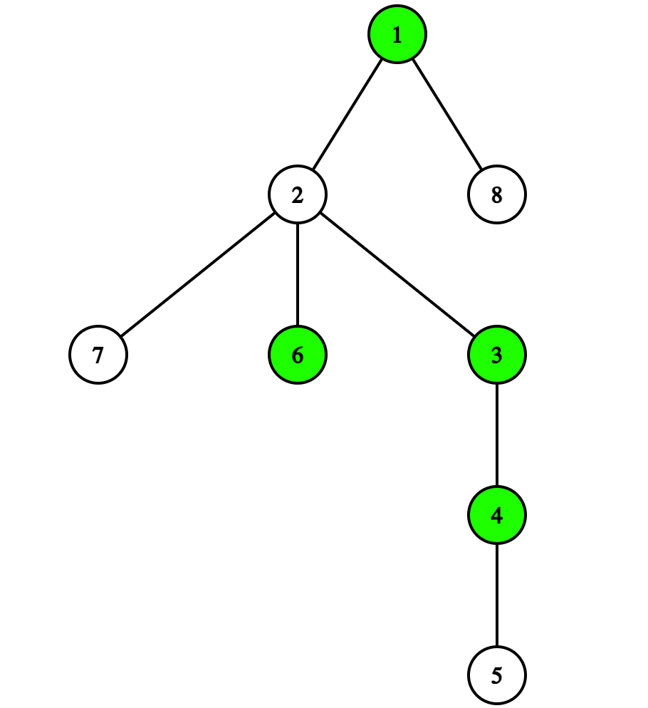
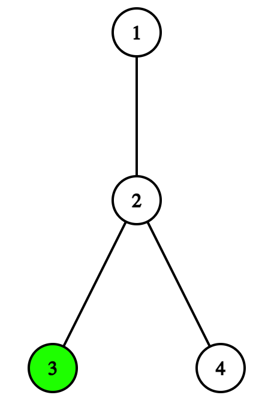

# A. Iris and Game on the Tree

**time limit per test:** 2 seconds

**memory limit per test:** 256 megabytes

**input:** standard input

**output:** standard output

Iris has a tree rooted at vertex $1$. Each vertex has a value of $\mathtt 0$ or $\mathtt 1$.

Let's consider a leaf of the tree (the vertex $1$ is never considered a leaf) and define its weight. Construct a string formed by the values of the vertices on the path starting at the root and ending in this leaf. Then the weight of the leaf is the difference between the number of occurrences of $\mathtt{10}$ and $\mathtt{01}$ substrings in it.

Take the following tree as an example. Green vertices have a value of $\mathtt 1$ while white vertices have a value of $\mathtt 0$.





- Let's calculate the weight of the leaf $5$: the formed string is $\mathtt{10110}$. The number of occurrences of substring $\mathtt{10}$ is $2$, the number of occurrences of substring $\mathtt{01}$ is $1$, so the difference is $2 - 1 = 1$.
- Let's calculate the weight of the leaf $6$: the formed string is $\mathtt{101}$. The number of occurrences of substring $\mathtt{10}$ is $1$, the number of occurrences of substring $\mathtt{01}$ is $1$, so the difference is $1 - 1 = 0$.

The score of a tree is defined as the number of leaves with non-zero weight in the tree.

But the values of some vertices haven't been decided and will be given to you as $\texttt{?}$. Filling the blanks would be so boring, so Iris is going to invite Dora to play a game. On each turn, one of the girls chooses any of the remaining vertices with value $\texttt{?}$ and changes its value to $\mathtt{0}$ or $\mathtt{1}$, with Iris going first. The game continues until there are no vertices with value $\mathtt{?}$ left in the tree. Iris aims to maximize the score of the tree, while Dora aims to minimize that.

Assuming that both girls play optimally, please determine the final score of the tree.

#### Input

Each test consists of multiple test cases. The first line contains a single integer $t$ ($1 \leq t \leq 5\cdot 10^4$) — the number of test cases. The description of the test cases follows.

The first line of each test case contains a single integer $n$ ($2 \leq n \leq 10^5$) — the number of vertices in the tree.

The following $n - 1$ lines each contain two integers $u$ and $v$ ($1 \leq u, v \leq n$) — denoting an edge between vertices $u$ and $v$.

It's guaranteed that the given edges form a tree.

The last line contains a string $s$ of length $n$. The $i$-th character of $s$ represents the value of vertex $i$. It's guaranteed that $s$ only contains characters $\mathtt{0}$, $\mathtt{1}$ and $\mathtt{?}$.

It is guaranteed that the sum of $n$ over all test cases doesn't exceed $2\cdot 10^5$.

#### Output

For each test case, output a single integer — the final score of the tree.

#### Example

#### Input
```
6
4
1 2
1 3
4 1
0101
4
1 2
3 2
2 4
???0
5
1 2
1 3
2 4
2 5
?1?01
6
1 2
2 3
3 4
5 3
3 6
?0????
5
1 2
1 3
1 4
1 5
11?1?
2
2 1
??
```

#### Output
```
2
1
1
2
1
0
```

#### Note

In the first test case, all the values of the vertices have been determined. There are three different paths from the root to a leaf:

- From vertex $1$ to vertex $2$. The string formed by the path is $\mathtt{01}$, so the weight of the leaf is $0-1=-1$.
- From vertex $1$ to vertex $3$. The string formed by the path is $\mathtt{00}$, so the weight of the leaf is $0-0=0$.
- From vertex $1$ to vertex $4$. The string formed by the path is $\mathtt{01}$, so the weight of the leaf is $0-1=-1$.

Thus, there are two leaves with non-zero weight, so the score of the tree is $2$.

In the second test case, one of the sequences of optimal choices for the two players can be:

- Iris chooses to change the value of the vertex $3$ to $\mathtt 1$.
- Dora chooses to change the value of the vertex $1$ to $\mathtt 0$.
- Iris chooses to change the value of the vertex $2$ to $\mathtt 0$.

The final tree is as follows:





The only leaf with non-zero weight is $3$, so the score of the tree is $1$. Note that this may not be the only sequence of optimal choices for Iris and Dora.
