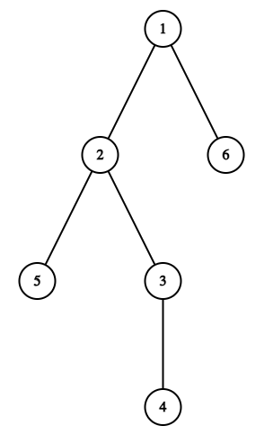
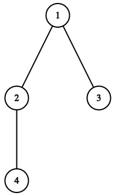
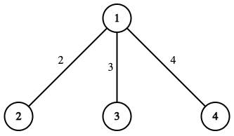

# B. Iris and the Tree

**time limit per test:** 3 seconds

**memory limit per test:** 256 megabytes

**input:** standard input

**output:** standard output

Given a rooted tree with the root at vertex $1$. For any vertex $i$ ($1 \lt i \leq n$) in the tree, there is an edge connecting vertices $i$ and $p_i$ ($1 \leq p_i \lt i$), with a weight equal to $t_i$.

Iris does not know the values of $t_i$, but she knows that $\displaystyle\sum_{i=2}^n t_i = w$ and each of the $t_i$ is a non-negative integer.

The vertices of the tree are numbered in a special way: the numbers of the vertices in each subtree are consecutive integers. In other words, the vertices of the tree are numbered in the order of a depth-first search.




 The tree in this picture satisfies the condition. For example, in the subtree of vertex $2$, the vertex numbers are $2, 3, 4, 5$, which are consecutive integers.



 The tree in this picture does not satisfy the condition, as in the subtree of vertex $2$, the vertex numbers $2$ and $4$ are not consecutive integers.
We define $\operatorname{dist}(u, v)$ as the length of the simple path between vertices $u$ and $v$ in the tree.

Next, there will be $n - 1$ events:

- Iris is given integers $x$ and $y$, indicating that $t_x = y$.

After each event, Iris wants to know the maximum possible value of $\operatorname{dist}(i, i \bmod n + 1)$ independently for each $i$ ($1\le i\le n$). She only needs to know the sum of these $n$ values. Please help Iris quickly get the answers.

Note that when calculating the maximum possible values of $\operatorname{dist}(i, i \bmod n + 1)$ and $\operatorname{dist}(j, j \bmod n + 1)$ for $i \ne j$, the unknown edge weights may be different.

#### Input

Each test consists of multiple test cases. The first line contains a single integer $t$ ($1 \leq t \leq 10^4$) — the number of test cases. The description of the test cases follows.

The first line of each test case contains two integers $n$ and $w$ ($2 \le n \le 2 \cdot 10^5$, $0 \leq w \leq 10^{12}$) — the number of vertices in the tree and the sum of the edge weights.

The second line of each test case contains $n - 1$ integers $p_2, p_3, \ldots, p_n$ ($1 \leq p_i \lt i$) — the description of the edges of the tree.

Then follow $n-1$ lines indicating the events. Each line contains two integers $x$ and $y$ ($2 \leq x \leq n$, $0 \leq y \leq w$), indicating that $t_x = y$.

It is guaranteed that all $x$ in the events are distinct. It is also guaranteed that the sum of all $y$ equals $w$.

It is guaranteed that the sum of $n$ over all test cases does not exceed $2 \cdot 10^5$.

#### Output

For each test case, output one line containing $n-1$ integers, each representing the answer after each event.

#### Example

#### Input
```
4
2 1000000000000
1
2 1000000000000
4 9
1 1 1
2 2
4 4
3 3
6 100
1 2 3 2 1
6 17
3 32
2 4
4 26
5 21
10 511
1 2 2 4 2 1 1 8 8
3 2
6 16
10 256
9 128
2 1
5 8
8 64
4 4
7 32
```

#### Output
```
2000000000000
25 18 18
449 302 247 200 200
4585 4473 2681 1567 1454 1322 1094 1022 1022
```

#### Note

In the first test case, $\operatorname{dist}(1, 2) = \operatorname{dist}(2, 1) = t_2 = w = 10^{12}$, so $\operatorname{dist}(1, 2) + \operatorname{dist}(2, 1) = 2 \cdot 10^{12}$.

In the second test case, the tree after Iris found out all $t_x$ is shown below:





$\operatorname{dist}(1, 2) = t_2$, $\operatorname{dist}(2, 3) = t_2 + t_3$, $\operatorname{dist}(3, 4) = t_3 + t_4$, $\operatorname{dist}(4, 1) = t_4$. After the first event, she found out that $t_2 = 2$, so $\operatorname{dist}(1, 2) = 2$. At the same time:

- $\operatorname{dist}(2, 3)$ is maximized if $t_3 = 7$, $t_4 = 0$. Then $\operatorname{dist}(2, 3) = 9$.
- $\operatorname{dist}(3, 4)$ and $\operatorname{dist}(4, 1)$ are maximized if $t_3 = 0$, $t_4 = 7$. Then $\operatorname{dist}(3, 4) = \operatorname{dist}(4, 1) = 7$.

Thus, the answer is $2 + 9 + 7 + 7 = 25$.

After the second event, she found out that $t_4 = 4$, then $t_3 = w - t_2 - t_4 = 4$. $\operatorname{dist}(1, 2) = 2$, $\operatorname{dist}(2, 3) = 2 + 3 = 5$, $\operatorname{dist}(3, 4) = 3 + 4 = 7$, $\operatorname{dist}(4, 1) = 4$. Thus, the answer is $2 + 5 + 7 + 4 = 18$.
