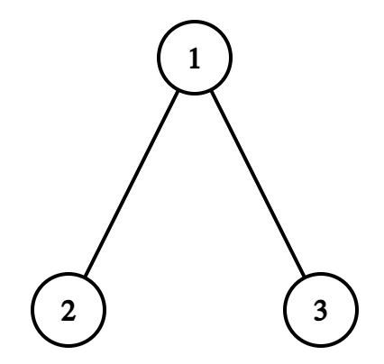
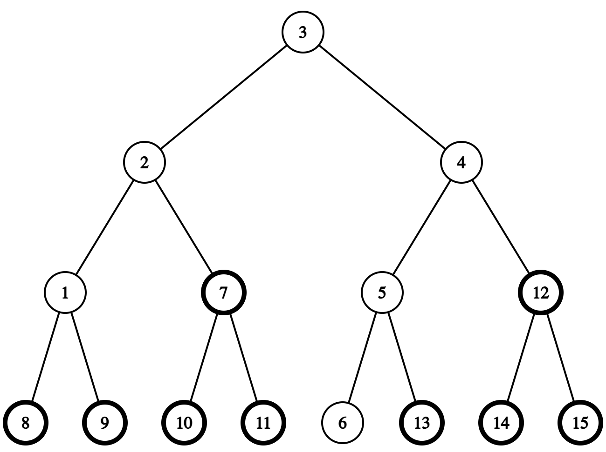
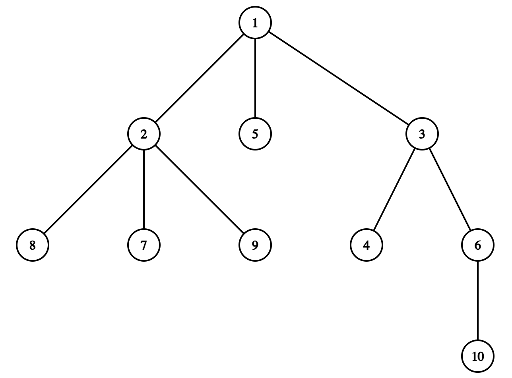

# E. Iris's Full Binary Tree

**time limit per test:** 4 seconds

**memory limit per test:** 1024 megabytes

**input:** standard input

**output:** standard output

Iris likes full binary trees.

Let's define the depth of a rooted tree as the maximum number of vertices on the simple paths from some vertex to the root. A full binary tree of depth $d$ is a binary tree of depth $d$ with exactly $2^d - 1$ vertices.

Iris calls a tree a $d$-binary tree if some vertices and edges can be added to it to make it a full binary tree of depth $d$. Note that any vertex can be chosen as the root of a full binary tree.

Since performing operations on large trees is difficult, she defines the binary depth of a tree as the minimum $d$ satisfying that the tree is $d$-binary. Specifically, if there is no integer $d \ge 1$ such that the tree is $d$-binary, the binary depth of the tree is $-1$.

Iris now has a tree consisting of only vertex $1$. She wants to add $n - 1$ more vertices to form a larger tree. She will add the vertices one by one. When she adds vertex $i$ ($2 \leq i \leq n$), she'll give you an integer $p_i$ ($1 \leq p_i \lt i$), and add a new edge connecting vertices $i$ and $p_i$.

Iris wants to ask you the binary depth of the tree formed by the first $i$ vertices for each $1 \le i \le n$. Can you tell her the answer?

#### Input

Each test consists of multiple test cases. The first line contains a single integer $t$ ($1 \leq t \leq 10^4$) — the number of test cases. The description of the test cases follows.

The first line of each test case contains a single integer $n$ ($2 \leq n \leq 5 \cdot 10^5$) — the final size of the tree.

The second line of each test case contains $n - 1$ integers $p_2, p_3, \ldots, p_n$ ($1 \leq p_i \lt i$) — descriptions of all edges of the tree.

It is guaranteed that the sum of $n$ over all test cases does not exceed $5 \cdot 10^5$.

#### Output

For each test case output $n$ integers, $i$-th of them representing the binary depth of the tree formed by the first $i$ vertices.

#### Example

#### Input
```
7
3
1 1
6
1 2 3 4 5
7
1 1 3 2 5 1
10
1 1 2 1 4 2 4 5 8
10
1 1 3 1 3 2 2 2 6
20
1 1 2 2 4 4 5 5 7 6 8 6 11 14 11 8 13 13 12
25
1 1 3 3 1 5 4 4 6 8 11 12 8 7 11 13 7 13 15 6 19 14 10 23
```

#### Output
```
1 2 2 
1 2 2 3 3 4 
1 2 2 3 3 4 4 
1 2 2 3 3 3 4 4 5 5 
1 2 2 3 3 4 4 4 -1 -1 
1 2 2 3 3 4 4 4 4 5 5 5 5 6 6 6 6 6 6 7 
1 2 2 3 3 4 4 4 4 5 5 6 6 6 6 6 7 7 7 7 7 8 8 8 8 
```

#### Note

In the first test case, the final tree is shown below:





- The tree consisting of the vertex $1$ has the binary depth $1$ (the tree itself is a full binary tree of depth $1$).
- The tree consisting of the vertices $1$ and $2$ has the binary depth $2$ (we can add the vertex $3$ to make it a full binary tree of depth $2$).
- The tree consisting of the vertices $1$, $2$ and $3$ has the binary depth $2$ (the tree itself is a full binary tree of depth $2$).

In the second test case, the formed full binary tree after adding some vertices to the tree consisting of $n$ vertices is shown below (bolded vertices are added):





The depth of the formed full binary tree is $4$.

In the fifth test case, the final tree is shown below:





It can be proved that Iris can't form any full binary tree by adding vertices and edges, so the binary depth is $-1$.
