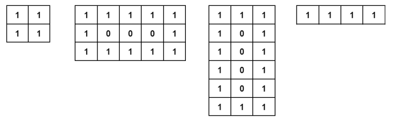

# B. Square or Not

**time limit per test:** 2 seconds

**memory limit per test:** 256 megabytes

**input:** standard input

**output:** standard output

A beautiful binary matrix is a matrix that has ones on its edges and zeros inside.




 Examples of four beautiful binary matrices.
Today, Sakurako was playing with a beautiful binary matrix of size $r \times c$ and created a binary string $s$ by writing down all the rows of the matrix, starting from the first and ending with the $r$-th. More formally, the element from the matrix in the $i$-th row and $j$-th column corresponds to the $((i-1)*c+j)$-th element of the string.

You need to check whether the beautiful matrix from which the string $s$ was obtained could be squared. In other words, you need to check whether the string $s$ could have been build from a square beautiful binary matrix (i.e., one where $r=c$).

#### Input

The first line contains a single integer $t$ ($1 \le t \le 10^4$) — the number of test cases.

The first line of each test case contains a single integer $n$ ($2 \le n \le 2 \cdot 10^5$) — the length of the string.

The second line of each test case contains the string $s$ of length $n$. The string is always the result of writing out the strings of a beautiful matrix.

It is guaranteed that the sum of $n$ across all test cases does not exceed $2 \cdot 10^5$.

#### Output

Print "Yes", if the original matrix could have been square, and "No" otherwise.

#### Example

#### Input
```
5
2
11
4
1111
9
111101111
9
111111111
12
111110011111
```

#### Output
```
No
Yes
Yes
No
No
```

#### Note

For the second test case, string 1111 can be obtained from the matrix:
 $1$$1$$1$$1$
For the third test case, string 111101111 can be obtained from the matrix:
 $1$$1$$1$$1$$0$$1$$1$$1$$1$
There is no square matrix in the fourth case, such that the string can be obtained from it.
