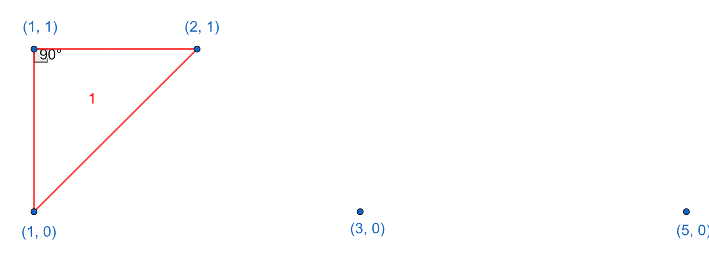

# D. Satyam and Counting

**time limit per test:** 2 seconds

**memory limit per test:** 256 megabytes

**input:** standard input

**output:** standard output

Satyam is given $n$ distinct points on the 2D coordinate plane. It is guaranteed that $0 \leq y_i \leq 1$ for all given points $(x_i, y_i)$. How many different nondegenerate right triangles$^{\text{∗}}$ can be formed from choosing three different points as its vertices?

Two triangles $a$ and $b$ are different if there is a point $v$ such that $v$ is a vertex of $a$ but not a vertex of $b$.

$^{\text{∗}}$A nondegenerate right triangle has positive area and an interior $90^{\circ}$ angle.

#### Input

The first line contains an integer $t$ ($1 \leq t \leq 10^4$) — the number of test cases.

The first line of each test case contains an integer $n$ ($3 \leq n \leq 2 \cdot 10^5$) — the number of points.

The following $n$ lines contain two integers $x_i$ and $y_i$ ($0 \leq x_i \leq n$, $0 \leq y_i \leq 1$) — the $i$'th point that Satyam can choose from. It is guaranteed that all $(x_i, y_i)$ are pairwise distinct.

It is guaranteed that the sum of $n$ over all test cases does not exceed $2 \cdot 10^5$.

#### Output

Output an integer for each test case, the number of distinct nondegenerate right triangles that can be formed from choosing three points.

#### Example

#### Input
```
3
5
1 0
1 1
3 0
5 0
2 1
3
0 0
1 0
3 0
9
1 0
2 0
3 0
4 0
5 0
2 1
7 1
8 1
9 1
```

#### Output
```
4
0
8
```

#### Note

The four triangles in question for the first test case:



