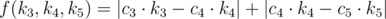

# E. Tractor College

**time limit per test:** 4 seconds

**memory limit per test:** 256 megabytes

**input:** stdin

**output:** stdout

While most students still sit their exams, the tractor college has completed the summer exam session. In fact, students study only one subject at this college — the Art of Operating a Tractor. Therefore, at the end of a term a student gets only one mark, a three (satisfactory), a four (good) or a five (excellent). Those who score lower marks are unfortunately expelled.

The college has *n* students, and oddly enough, each of them can be on scholarship. The size of the scholarships varies each term. Since the end-of-the-term exam has just ended, it's time to determine the size of the scholarship to the end of next term.

The monthly budget for the scholarships of the Tractor college is *s* rubles. To distribute the budget optimally, you must follow these rules:

- The students who received the same mark for the exam, should receive the same scholarship;
- Let us denote the size of the scholarship (in roubles) for students who have received marks 3, 4 and 5 for the exam, as *k*~3~, *k*~4~ and *k*~5~, respectively. The values *k*~3~, *k*~4~ and *k*~5~ must be integers and satisfy the inequalities 0 ≤ *k*~3~ ≤ *k*~4~ ≤ *k*~5~;
- Let's assume that *c*~3~, *c*~4~, *c*~5~ show how many students received marks 3, 4 and 5 for the exam, respectively. The budget of the scholarship should be fully spent on them, that is, *c*~3~·*k*~3~ + *c*~4~·*k*~4~ + *c*~5~·*k*~5~ = *s*;
- Let's introduce function



 — the value that shows how well the scholarships are distributed between students. In the optimal distribution function *f*(*k*~3~, *k*~4~, *k*~5~) takes the minimum possible value.

Given the results of the exam, and the budget size *s*, you have to find the optimal distribution of the scholarship.

#### Input

The first line has two integers *n*, *s* (3 ≤ *n* ≤ 300, 1 ≤ *s* ≤ 3·10^5^) — the number of students and the budget size for the scholarship, respectively. The second line contains *n* integers, where the *i*-th number represents the mark that the *i*-th student got for the exam. It is guaranteed that at each mark was given to at least one student.

#### Output

On a single line print three integers *k*~3~, *k*~4~ and *k*~5~ — the sought values that represent the optimal distribution of the scholarships. If there are multiple optimal answers, print any of them. If there is no answer, print -1.

#### Examples

#### Input
```
5 11
3 4 3 5 5
```

#### Output
```
1 3 3
```

#### Input
```
6 15
5 3 3 4 4 5
```

#### Output
```
-1
```
