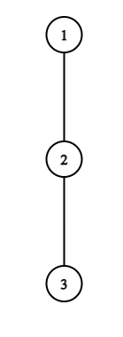

# F1. Game in Tree (Easy Version)

**time limit per test:** 4 seconds

**memory limit per test:** 256 megabytes

**input:** standard input

**output:** standard output

This is the easy version of the problem. In this version, $\mathbf{u = v}$. You can make hacks only if both versions of the problem are solved.

Alice and Bob are playing a fun game on a tree. This game is played on a tree with $n$ vertices, numbered from $1$ to $n$. Recall that a tree with $n$ vertices is an undirected connected graph with $n - 1$ edges.

Alice and Bob take turns, with Alice going first. Each player starts at some vertex.

On their turn, a player must move from the current vertex to a neighboring vertex that has not yet been visited by anyone. The first player who cannot make a move loses.

You are given two vertices $u$ and $v$. Represent the simple path from vertex $u$ to $v$ as an array $p_1, p_2, p_3, \ldots, p_m$, where $p_1 = u$, $p_m = v$, and there is an edge between $p_i$ and $p_{i + 1}$ for all $i$ ($1 \le i \lt m$).

You need to determine the winner of the game if Alice starts at vertex $1$ and Bob starts at vertex $p_j$ for each $j$ (where $1 \le j \le m$).

#### Input

Each test contains multiple test cases. The first line contains the number of test cases $t$ ($1 \le t \le 10^4$). The description of the test cases follows.

The first line of each test case contains a single integer $n$ ($2 \le n \le 2 \cdot 10^5$) — the number of vertices in the tree.

Each of the following $n - 1$ lines contains two integers $a$ and $b$ ($1 \le a, b \le n$), denoting an undirected edge between vertices $a$ and $b$. It is guaranteed that these edges form a tree.

The last line of each test case contains two integers $u$ and $v$ ($2 \le u, v \le n$, $\mathbf{u = v}$).

It is guaranteed that the path from $u$ to $v$ does not pass through vertex $1$.

It is guaranteed that the sum of $n$ over all test cases does not exceed $2 \cdot 10^5$.

#### Output

For each test case, output $m$ lines.

In the $i$-th line, print the winner of the game if Alice starts at vertex $1$ and Bob starts at vertex $p_i$. Print "Alice" (without quotes) if Alice wins, or "Bob" (without quotes) otherwise.

#### Example

#### Input
```
3
3
1 2
2 3
2 2
3
1 2
2 3
3 3
6
1 2
1 3
2 4
2 5
1 6
4 4
```

#### Output
```
Bob
Alice
Alice
```

#### Note




 Tree from the first and second examples.
In the first test case, the path will be ($2,2$). Bob starts at vertex $2$, Alice will not be able to move anywhere on her first turn and will lose.

In the second test case, the path will be ($3,3$). Bob starts at vertex $3$, Alice will move to vertex $2$, and Bob will have no remaining vertices to visit and will lose.
