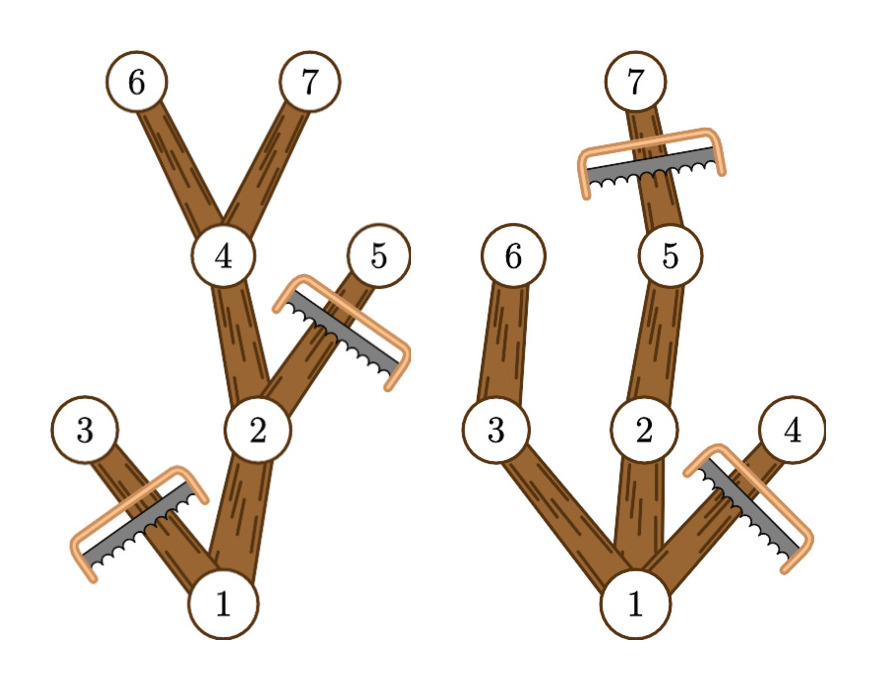

# C. Tree Pruning

**time limit per test:** 3 seconds

**memory limit per test:** 256 megabytes

**input:** standard input

**output:** standard output

[t+pazolite, ginkiha, Hommarju - Paved Garden](<https://soundcloud.com/fractalex-gd/ginkiha-paved-garden-little>)

⠀

You are given a tree with $n$ nodes, rooted at node $1$. In this problem, a leaf is a non-root node with degree $1$.

In one operation, you can remove a leaf and the edge adjacent to it (possibly, new leaves appear). What is the minimum number of operations that you have to perform to get a tree, also rooted at node $1$, where all the leaves are at the same distance from the root?

#### Input

Each test contains multiple test cases. The first line contains the number of test cases $t$ ($1 \le t \le 10^4$). The description of the test cases follows.

The first line of each test case contains a single integer $n$ ($3 \leq n \leq 5 \cdot 10^5$) — the number of nodes.

Each of the next $n-1$ lines contains two integers $u$, $v$ ($1 \leq u, v \leq n$, $u \neq v$), describing an edge that connects $u$ and $v$. It is guaranteed that the given edges form a tree.

It is guaranteed that the sum of $n$ over all test cases does not exceed $5 \cdot 10^5$.

#### Output

For each test case, output a single integer: the minimum number of operations needed to achieve your goal.

#### Example

#### Input
```
3
7
1 2
1 3
2 4
2 5
4 6
4 7
7
1 2
1 3
1 4
2 5
3 6
5 7
15
12 9
1 6
6 14
9 11
8 7
3 5
13 5
6 10
13 15
13 6
14 12
7 2
8 1
1 4
```

#### Output
```
2
2
5
```

#### Note

In the first two examples, the tree is as follows:





In the first example, by removing edges $(1, 3)$ and $(2, 5)$, the resulting tree has all leaves (nodes $6$ and $7$) at the same distance from the root (node $1$), which is $3$. The answer is $2$, as it is the minimum number of edges that need to be removed to achieve the goal.

In the second example, removing edges $(1, 4)$ and $(5, 7)$ results in a tree where all leaves (nodes $4$ and $5$) are at the same distance from the root (node $1$), which is $2$.
