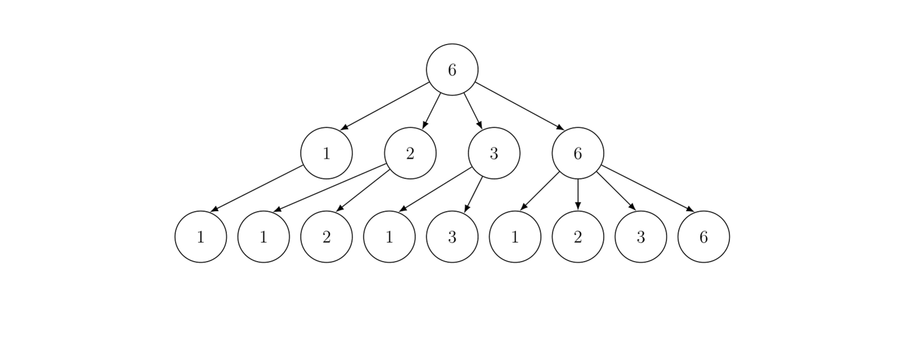

# F. Count Leaves

**time limit per test:** 4 seconds

**memory limit per test:** 256 megabytes

**input:** standard input

**output:** standard output

Let $n$ and $d$ be positive integers. We build the the divisor tree $T_{n,d}$ as follows:

- The root of the tree is a node marked with number $n$. This is the $0$-th layer of the tree.
- For each $i$ from $0$ to $d - 1$, for each vertex of the $i$-th layer, do the following. If the current vertex is marked with $x$, create its children and mark them with all possible distinct divisors$^\dagger$ of $x$. These children will be in the $(i+1)$-st layer.
- The vertices on the $d$-th layer are the leaves of the tree.

For example, $T_{6,2}$ (the divisor tree for $n = 6$ and $d = 2$) looks like this:





Define $f(n,d)$ as the number of leaves in $T_{n,d}$.

Given integers $n$, $k$, and $d$, please compute $\sum\limits_{i=1}^{n} f(i^k,d)$, modulo $10^9+7$.

$^\dagger$ In this problem, we say that an integer $y$ is a divisor of $x$ if $y \ge 1$ and there exists an integer $z$ such that $x = y \cdot z$.

#### Input

Each test contains multiple test cases. The first line contains the number of test cases $t$ ($1 \le t \le 10^4$). The description of the test cases follows.

The only line of each test case contains three integers $n$, $k$, and $d$ ($1 \le n \le 10^9$, $1 \le k,d \le 10^5$).

It is guaranteed that the sum of $n$ over all test cases does not exceed $10^9$.

#### Output

For each test case, output $\sum\limits_{i=1}^{n} f(i^k,d)$, modulo $10^9+7$.

#### Example

#### Input
```
3
6 1 1
1 3 3
10 1 2
```

#### Output
```
14
1
53
```

#### Note

In the first test case, $n = 6$, $k = 1$, and $d = 1$. Thus, we need to find the total number of leaves in the divisor trees $T_{1,1}$, $T_{2,1}$, $T_{3,1}$, $T_{4,1}$, $T_{5,1}$, $T_{6,1}$.

- $T_{1,1}$ has only one leaf, which is marked with $1$.
- $T_{2,1}$ has two leaves, marked with $1$ and $2$.
- $T_{3,1}$ has two leaves, marked with $1$ and $3$.
- $T_{4,1}$ has three leaves, marked with $1$, $2$, and $4$.
- $T_{5,1}$ has two leaves, marked with $1$ and $5$.
- $T_{6,1}$ has four leaves, marked with $1$, $2$, $3$, and $6$.

The total number of leaves is $1 + 2 + 2 + 3 + 2 + 4 = 14$.

In the second test case, $n = 1$, $k = 3$, $d = 3$. Thus, we need to find the number of leaves in $T_{1,3}$, because $1^3 = 1$. This tree has only one leaf, so the answer is $1$.
