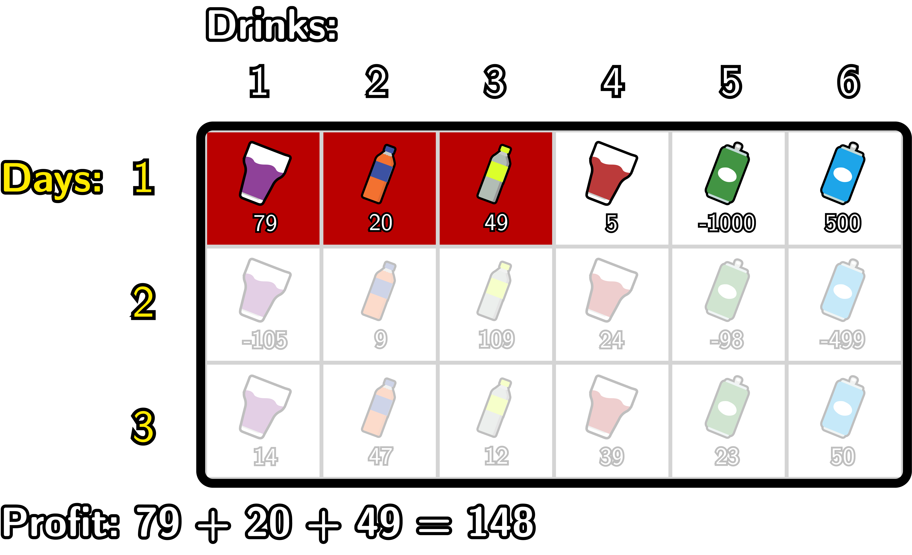
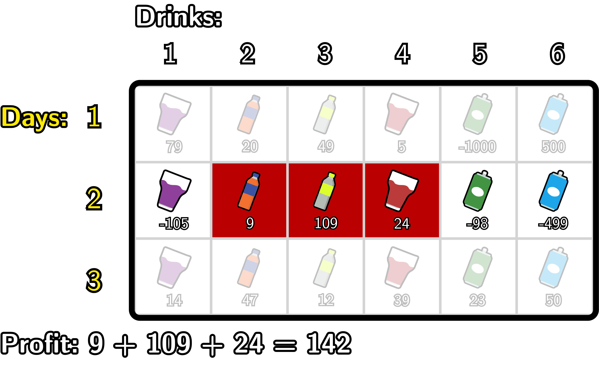
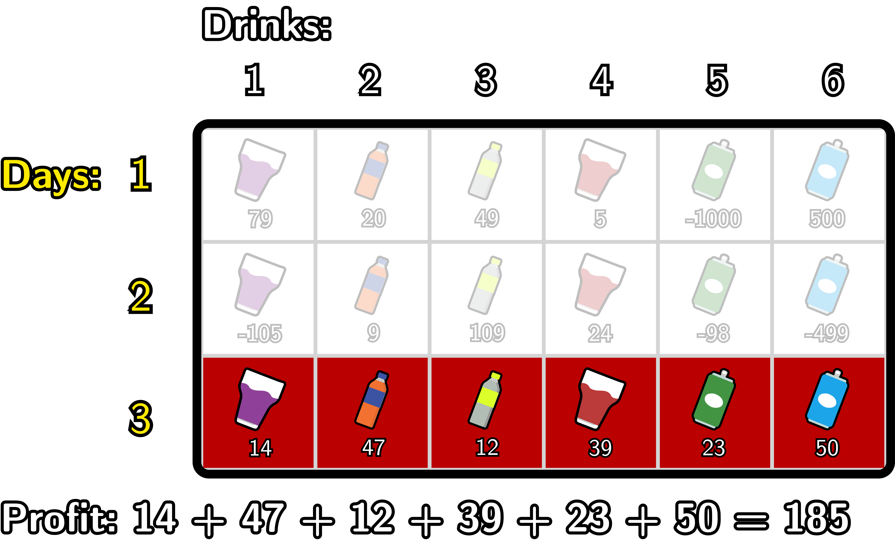

# D. Boss, Thirsty

**time limit per test:** 2 seconds

**memory limit per test:** 256 megabytes

**input:** standard input

**output:** standard output

Pak Chanek has a friend who runs a drink stall in a canteen. His friend will sell drinks for $n$ days, numbered from day $1$ to day $n$. There are also $m$ types of drinks, numbered from $1$ to $m$.

The profit gained from selling a drink on a particular day can vary. On day $i$, the projected profit from selling drink of type $j$ is $A_{i, j}$. Note that $A_{i, j}$ can be negative, meaning that selling the drink would actually incur a loss.

Pak Chanek wants to help his friend plan the sales over the $n$ days. On day $i$, Pak Chanek must choose to sell at least one type of drink. Furthermore, the types of drinks sold on a single day must form a subarray. In other words, in each day, Pak Chanek will select $i$ and $j$ such that $1 \leq i \leq j \leq m$. Then all types of drinks between $i$ and $j$ (inclusive) will be sold.

However, to ensure that customers from the previous day keep returning, the selection of drink types sold on day $i$ ($i \gt 1$) must meet the following conditions:

- At least one drink type sold on day $i$ must also have been sold on day $i-1$.
- At least one drink type sold on day $i$ must not have been sold on day $i-1$.

The daily profit is the sum of the profits from all drink types sold on that day. The total profit from the sales plan is the sum of the profits over $n$ days. What is the maximum total profit that can be achieved if Pak Chanek plans the sales optimally?

#### Input

Each test contains multiple test cases. The first line contains the number of test cases $t$ ($1 \le t \le 1000$). The description of the test cases follows.

The first line of each test case contains two integers $n$ and $m$ ($1 \leq n \leq 2 \cdot 10^5$; $3 \leq m \leq 2 \cdot 10^5$; $n \cdot m \leq 2 \cdot 10^5$) — the number of rows and columns in a grid.

The next $n$ lines of each test case contain $m$ integers each, where the $i$-th line contains the integers $A_{i,1} A_{i,2}, \ldots, A_{i,m}$ ($-10^9 \leq A_{i,j} \leq 10^9$) — project profits of each drink type on the $i$-th day.

It is guaranteed that the sum of $n \cdot m$ over all test cases does not exceed $2 \cdot 10^5$.

#### Output

For each test case, output a single integer: the maximum profit that Pak Chanek can achieve.

#### Example

#### Input
```
1
3 6
79 20 49 5 -1000 500
-105 9 109 24 -98 -499
14 47 12 39 23 50
```

#### Output
```
475
```

#### Note

Here is Pak Chanek's optimal plan:









- On day $1$, Pak Chanek sells drink types $1$ to $3$. Generating a profit of $79+20+49 = 148$.
- On day $2$, Pak Chanek sells drink types $2$ to $4$. Generating a profit of $9+109+24 = 142$
- On day $3$, Pak Chanek sells drink types $1$ to $6$. Generating a profit of $185$.

So, the total profit of Pak Chanek's plan is $148 + 142 + 185 = 475$.
