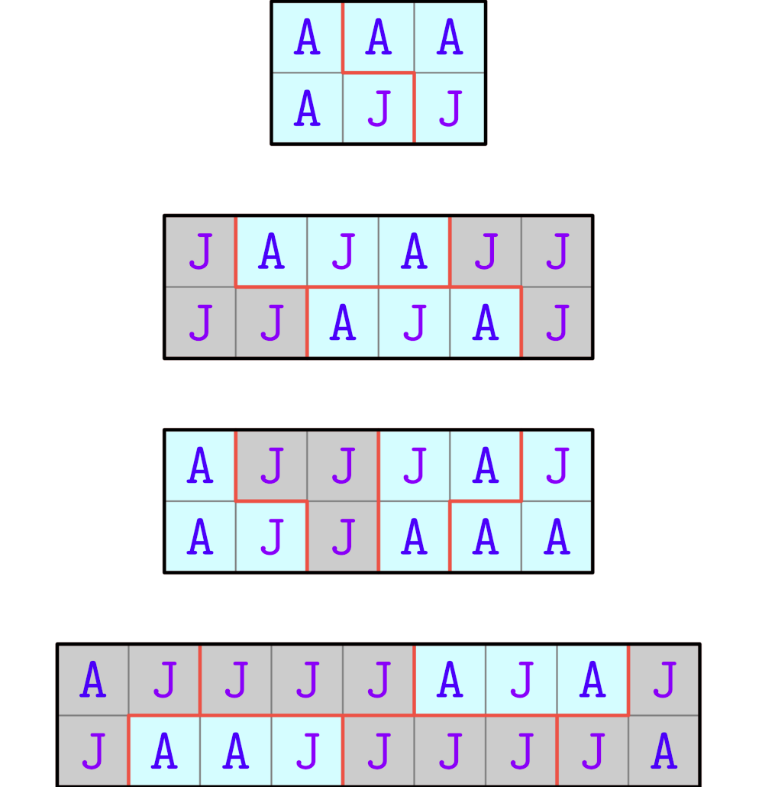

# C. Gerrymandering

**time limit per test:** 2 seconds

**memory limit per test:** 256 megabytes

**input:** standard input

**output:** standard output

We all steal a little bit. But I have only one hand, while my adversaries have two.

Álvaro Obregón

Álvaro and José are the only candidates running for the presidency of Tepito, a rectangular grid of $2$ rows and $n$ columns, where each cell represents a house. It is guaranteed that $n$ is a multiple of $3$.

Under the voting system of Tepito, the grid will be split into districts, which consist of any $3$ houses that are connected$^{\text{∗}}$. Each house will belong to exactly one district.

Each district will cast a single vote. The district will vote for Álvaro or José respectively if at least $2$ houses in that district select them. Therefore, a total of $\frac{2n}{3}$ votes will be cast.

As Álvaro is the current president, he knows exactly which candidate each house will select. If Álvaro divides the houses into districts optimally, determine the maximum number of votes he can get.

$^{\text{∗}}$A set of cells is connected if there is a path between any $2$ cells that requires moving only up, down, left and right through cells in the set.

#### Input

Each test contains multiple test cases. The first line contains the number of test cases $t$ ($1 \le t \le 10^4$). The description of the test cases follows.

The first line of each test case contains one integer $n$ ($3 \le n \le 10^5$; $n$ is a multiple of $3$) — the number of columns of Tepito.

The following two lines each contain a string of length $n$. The $i$-th line contains the string $s_i$, consisting of the characters $\texttt{A}$ and $\texttt{J}$. If $s_{i,j}=\texttt{A}$, the house in the $i$-th row and $j$-th column will select Álvaro. Otherwise if $s_{i,j}=\texttt{J}$, the house will select José.

It is guaranteed that the sum of $n$ over all test cases does not exceed $10^5$.

#### Output

For each test case, output a single integer — the maximum number of districts Álvaro can win by optimally dividing the houses into districts.

#### Example

#### Input
```
4
3
AAA
AJJ
6
JAJAJJ
JJAJAJ
6
AJJJAJ
AJJAAA
9
AJJJJAJAJ
JAAJJJJJA
```

#### Output
```
2
2
3
2
```

#### Note

The image below showcases the optimal arrangement of districts Álvaro can use for each test case in the example.



