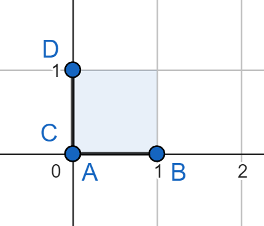
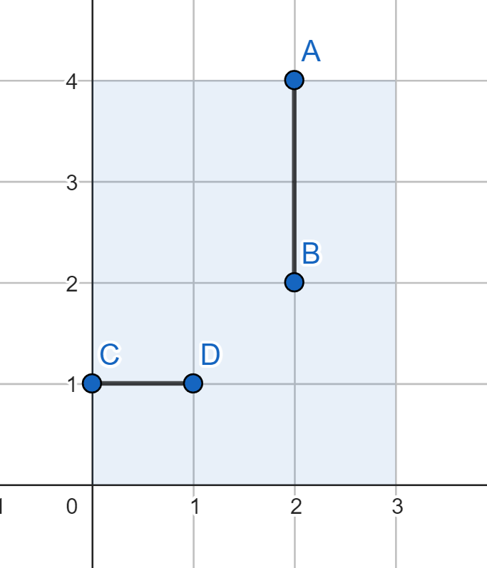
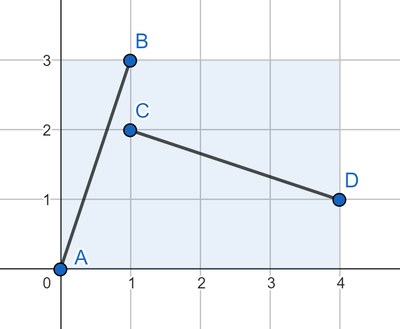
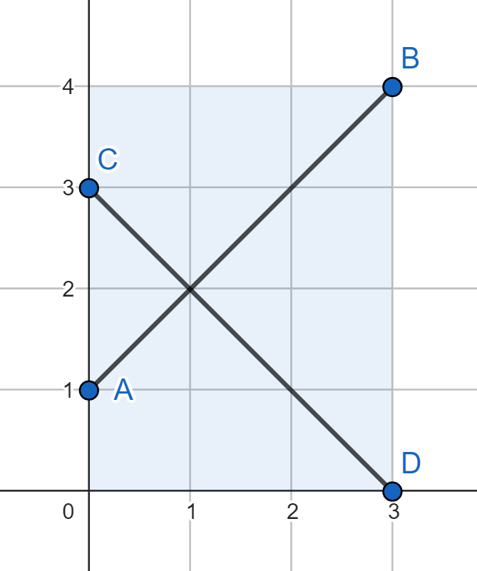

# A. Perpendicular Segments

**time limit per test:** 2 seconds

**memory limit per test:** 256 megabytes

**input:** standard input

**output:** standard output

You are given a coordinate plane and three integers $X$, $Y$, and $K$. Find two line segments $AB$ and $CD$ such that

- the coordinates of points $A$, $B$, $C$, and $D$ are integers;
- $0 \le A_x, B_x, C_x, D_x \le X$ and $0 \le A_y, B_y, C_y, D_y \le Y$;
- the length of segment $AB$ is at least $K$;
- the length of segment $CD$ is at least $K$;
- segments $AB$ and $CD$ are perpendicular: if you draw lines that contain $AB$ and $CD$, they will cross at a right angle.

Note that it's not necessary for segments to intersect. Segments are perpendicular as long as the lines they induce are perpendicular.

#### Input

The first line contains a single integer $t$ ($1 \le t \le 5000$) — the number of test cases. Next, $t$ cases follow.

The first and only line of each test case contains three integers $X$, $Y$, and $K$ ($1 \le X, Y \le 1000$; $1 \le K \le 1414$).

Additional constraint on the input: the values of $X$, $Y$, and $K$ are chosen in such a way that the answer exists.

#### Output

For each test case, print two lines. The first line should contain $4$ integers $A_x$, $A_y$, $B_x$, and $B_y$ — the coordinates of the first segment.

The second line should also contain $4$ integers $C_x$, $C_y$, $D_x$, and $D_y$ — the coordinates of the second segment.

If there are multiple answers, print any of them.

#### Example

#### Input
```
4
1 1 1
3 4 1
4 3 3
3 4 4
```

#### Output
```
0 0 1 0
0 0 0 1
2 4 2 2
0 1 1 1
0 0 1 3
1 2 4 1
0 1 3 4
0 3 3 0
```

#### Note

The answer for the first test case is shown below:




 The answer for the second test case:



 The answer for the third test case:



 The answer for the fourth test case:


