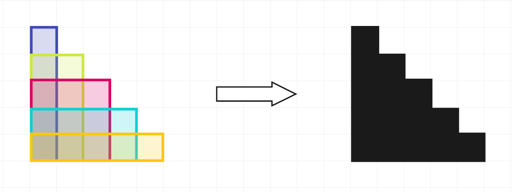

# A. Rectangle Arrangement

**time limit per test:** 1 second

**memory limit per test:** 256 megabytes

**input:** standard input

**output:** standard output

You are coloring an infinite square grid, in which all cells are initially white. To do this, you are given $n$ stamps. Each stamp is a rectangle of width $w_i$ and height $h_i$.

You will use each stamp exactly once to color a rectangle of the same size as the stamp on the grid in black. You cannot rotate the stamp, and for each cell, the stamp must either cover it fully or not cover it at all. You can use the stamp at any position on the grid, even if some or all of the cells covered by the stamping area are already black.

What is the minimum sum of the perimeters of the connected regions of black squares you can obtain after all the stamps have been used?

#### Input

Each test contains multiple test cases. The first line contains the number of test cases $t$ ($1 \le t \le 500$). The description of the test cases follows.

The first line of each test case contains a single integer $n$ ($1 \le n \le 100$).

The $i$-th of the next $n$ lines contains two integers $w_i$ and $h_i$ ($1 \le w_i, h_i \le 100$).

#### Output

For each test case, output a single integer — the minimum sum of the perimeters of the connected regions of black squares you can obtain after all the stamps have been used.

#### Example

#### Input
```
5
5
1 5
2 4
3 3
4 2
5 1
3
2 2
1 1
1 2
1
3 2
3
100 100
100 100
100 100
4
1 4
2 3
1 5
3 2
```

#### Output
```
20
8
10
400
16
```

#### Note

In the first test case, the stamps can be used as shown on the left. Each stamp is highlighted in its own color for clarity.





After all these stamps are used, there is one black region (as shown on the right), and its perimeter is $20$. It can be shown that there is no way of using the stamps that yields a lower total perimeter.

In the second test case, the second and third stamps can be used entirely inside the first one, so the minimum perimeter is equal to $8$.
