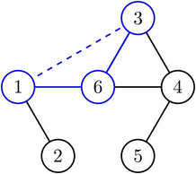
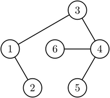
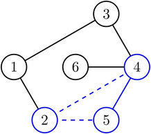
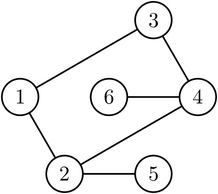
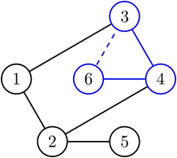
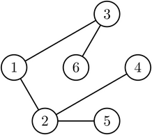

# D. Cool Graph

**time limit per test:** 3 seconds

**memory limit per test:** 512 megabytes

**input:** standard input

**output:** standard output

You are given an undirected graph with $n$ vertices and $m$ edges.

You can perform the following operation at most $2\cdot \max(n,m)$ times:

- Choose three distinct vertices $a$, $b$, and $c$, then for each of the edges $(a,b)$, $(b,c)$, and $(c,a)$, do the following:

 - If the edge does not exist, add it. On the contrary, if it exists, remove it.


A graph is called cool if and only if one of the following holds:

- The graph has no edges, or
- The graph is a tree.

You have to make the graph cool by performing the above operations. Note that you can use at most $2\cdot \max(n,m)$ operations.

It can be shown that there always exists at least one solution.

#### Input

Each test contains multiple test cases. The first line of input contains a single integer $t$ ($1\le t\le 10^4$) — the number of test cases. The description of test cases follows.

The first line of each test case contains two integers $n$ and $m$ ($3\le n\le 10^5$, $0\le m\le \min\left(\frac{n(n-1)}{2},2\cdot 10^5\right)$) — the number of vertices and the number of edges.

Then $m$ lines follow, the $i$-th line contains two integers $u_i$ and $v_i$ ($1\le u_i,v_i\le n$) — the two nodes that the $i$-th edge connects.

It is guaranteed that the sum of $n$ over all test cases does not exceed $10^5$, and the sum of $m$ over all test cases does not exceed $2\cdot 10^5$.

It is guaranteed that there are no self-loops or multiple-edges in the given graph.

#### Output

For each test case, in the first line output an integer $k$ ($0\le k\le 2\cdot \max(n, m)$) — the number of operations.

Then output $k$ lines, the $i$-th line containing three distinct integers $a$, $b$, and $c$ ($1\le a,b,c\le n$) — the three integers you choose in the $i$-th operation.

If there are multiple solutions, you can output any of them.

#### Example

#### Input
```
5
3 0
3 1
1 2
3 2
1 2
2 3
3 3
1 2
2 3
3 1
6 6
1 2
1 6
4 5
3 4
4 6
3 6
```

#### Output
```
0
1
1 2 3
0
1
1 2 3
3
1 3 6
2 4 5
3 4 6
```

#### Note

In the first test case, the graph is already cool because there are no edges.

In the second test case, after performing the only operation, the graph becomes a tree, so it is cool.

In the third test case, the graph is already cool because it is a tree.

In the fourth test case, after performing the only operation, the graph has no edges, so it is cool.

In the fifth test case:
 OperationGraph before the operationGraph after the operation$1$





$2$





$3$






Note that after the first operation, the graph has already become cool, and there are two extra operations. As the graph is still cool after the two extra operations, this is a valid answer.
