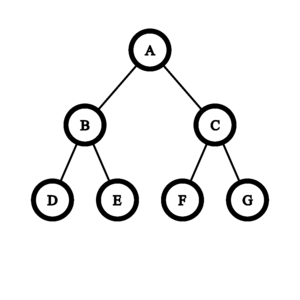
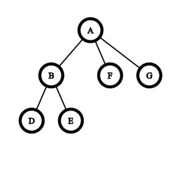

# E. Penchick and Chloe's Trees

**time limit per test:** 3.5 seconds

**memory limit per test:** 512 megabytes

**input:** standard input

**output:** standard output


With just a few hours left until Penchick and Chloe leave for Singapore, they could hardly wait to see the towering trees at the Singapore Botanic Gardens! Attempting to contain their excitement, Penchick crafted a rooted tree to keep Chloe and himself busy.

Penchick has a rooted tree$^{\text{∗}}$ consisting of $n$ vertices, numbered from $1$ to $n$, with vertex $1$ as the root, and Chloe can select a non-negative integer $d$ to create a perfect binary tree$^{\text{†}}$ of depth $d$.

Since Penchick and Chloe are good friends, Chloe wants her tree to be isomorphic$^{\text{‡}}$ to Penchick's tree. To meet this condition, Chloe can perform the following operation on her own tree any number of times:

- Select an edge $(u,v)$, where $u$ is the parent of $v$.
- Remove vertex $v$ and all the edges connected to $v$, then connect all of $v$'s previous children directly to $u$.

In particular, doing an operation on an edge $(u, v)$ where $v$ is a leaf will delete vertex $v$ without adding any new edges.

Since constructing a perfect binary tree can be time-consuming, Chloe wants to choose the minimum $d$ such that a perfect binary tree of depth $d$ can be made isomorphic to Penchick's tree using the above operation. Note that she can't change the roots of the trees.

$^{\text{∗}}$A tree is a connected graph without cycles. A rooted tree is a tree where one vertex is special and called the root. The parent of vertex $v$ is the first vertex on the simple path from $v$ to the root. The root has no parent. A child of vertex $v$ is any vertex $u$ for which $v$ is the parent. A leaf is any vertex without children.

$^{\text{†}}$A full binary tree is rooted tree, in which each node has $0$ or $2$ children. A perfect binary tree is a full binary tree in which every leaf is at the same distance from the root. The depth of such a tree is the distance from the root to a leaf.

$^{\text{‡}}$Two rooted trees, rooted at $r_1$ and $r_2$ respectively, are considered isomorphic if there exists a permutation $p$ of the vertices such that an edge $(u, v)$ exists in the first tree if and only if the edge $(p_u, p_v)$ exists in the second tree, and $p_{r_1} = r_2$.

#### Input

Each test contains multiple test cases. The first line contains the number of test cases $t$ ($1 \le t \le 10^5$). The description of the test cases follows.

The first line of each test case contains a single integer $n$ ($2 \le n \le 10^6$) — the number of vertices in Penchick's tree.

The second line of each test case contains $n-1$ integers $p_2, p_3, \ldots, p_n$ ($1 \leq p_i \leq i-1$) — the parent of vertex $i$.

It is guaranteed that the sum of $n$ over all test cases does not exceed $10^6$.

#### Output

For each test case, output a single integer on each line: the minimum depth of Chloe's perfect binary tree.

#### Example

#### Input
```
5
6
1 2 2 1 1
15
1 1 2 2 3 3 4 4 5 5 6 6 7 7
5
1 2 2 2
7
1 1 2 1 1 2
10
1 1 1 2 2 2 4 3 3
```

#### Output
```
2
3
3
3
3
```

#### Note

For the first test case, create a perfect binary tree with depth $2$.



Consider carrying out the operation on edge $AC$. Then the edges $AC$, $CF$, and $CG$ are removed, and edges $AF$ and $AG$ are added.



The resulting tree is isomorphic to the tree given in the input. It can be proven that no sequence of operations carried out on a binary tree of depth less than $2$ can lead to a tree isomorphic to the tree given in the input.

In the second test case, the tree is already isomorphic to a perfect binary tree of depth $3$.
