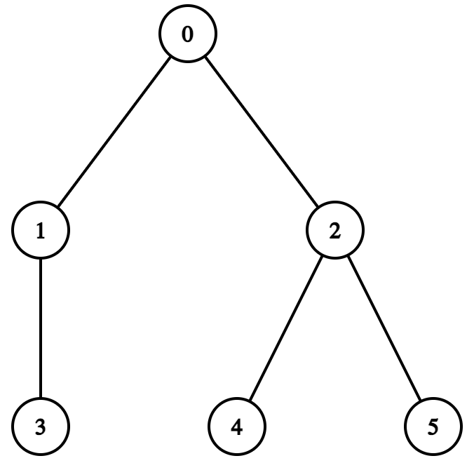
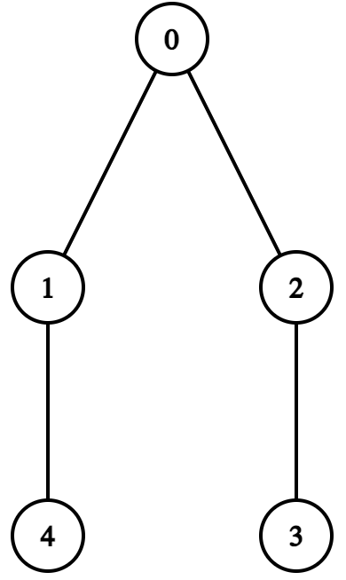
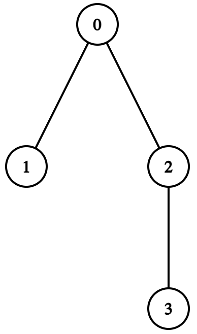
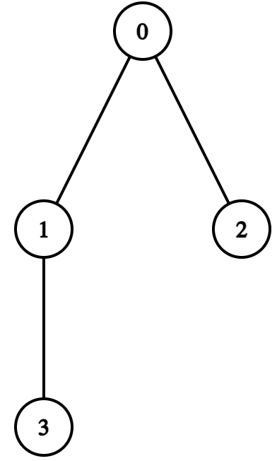
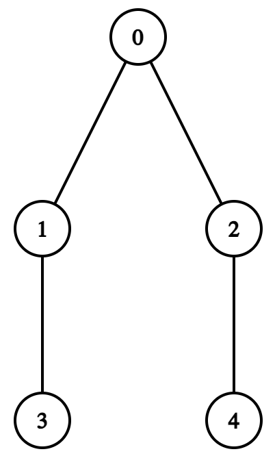
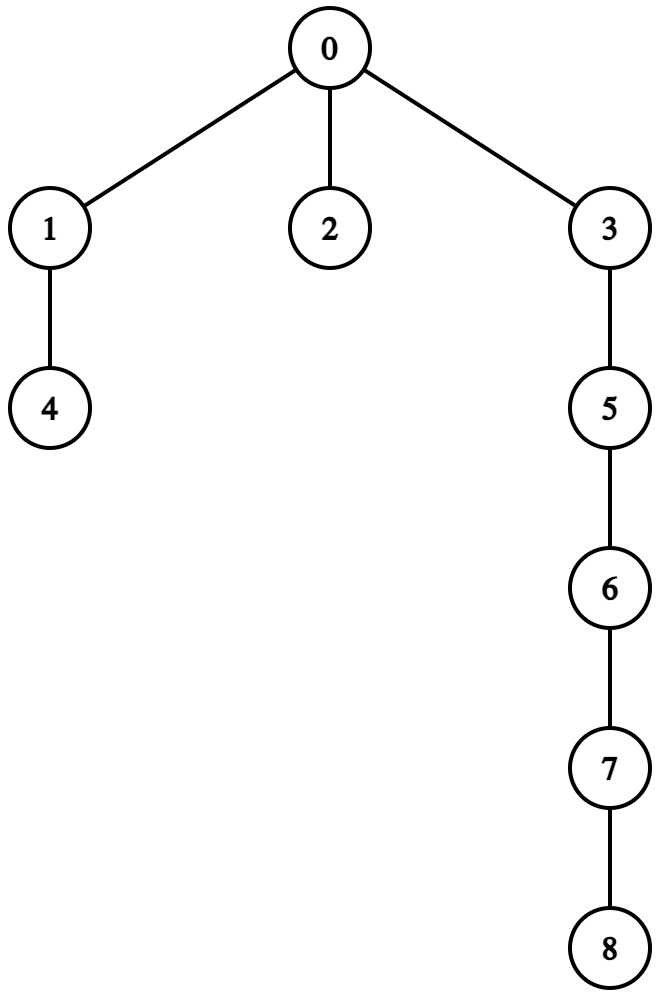

# D. Genokraken

**time limit per test:** 2 seconds

**memory limit per test:** 256 megabytes

**input:** standard input

**output:** standard output

This is an interactive problem.

Upon clearing the Waterside Area, Gretel has found a monster named Genokraken, and she's keeping it contained for her scientific studies.

The monster's nerve system can be structured as a tree$^{\dagger}$ of $n$ nodes (really, everything should stop resembling trees all the time$\ldots$), numbered from $0$ to $n-1$, with node $0$ as the root.

Gretel's objective is to learn the exact structure of the monster's nerve system — more specifically, she wants to know the values $p_1, p_2, \ldots, p_{n-1}$ of the tree, where $p_i$ ($0 \le p_i \lt i$) is the direct parent node of node $i$ ($1 \le i \le n - 1$).

She doesn't know exactly how the nodes are placed, but she knows a few convenient facts:

- If we remove root node $0$ and all adjacent edges, this tree will turn into a forest consisting of only paths$^{\ddagger}$. Each node that was initially adjacent to the node $0$ will be the end of some path.
- The nodes are indexed in a way that if $1 \le x \le y \le n - 1$, then $p_x \le p_y$.
- Node $1$ has exactly two adjacent nodes (including the node $0$).








The tree in this picture does not satisfy the condition, because if we remove node $0$, then node $2$ (which was initially adjacent to the node $0$) will not be the end of the path $4-2-5$.The tree in this picture does not satisfy the condition, because $p_3 \le p_4$ must hold.The tree in this picture does not satisfy the condition, because node $1$ has only one adjacent node.
Gretel can make queries to the containment cell:

- "? a b" ($1 \le a, b \lt n$, $a \ne b$) — the cell will check if the simple path between nodes $a$ and $b$ contains the node $0$.

However, to avoid unexpected consequences by overstimulating the creature, Gretel wants to query at most $2n - 6$ times. Though Gretel is gifted, she can't do everything all at once, so can you give her a helping hand?

$^{\dagger}$A tree is a connected graph where every pair of distinct nodes has exactly one simple path connecting them.

$^{\ddagger}$A path is a tree whose vertices can be listed in the order $v_1, v_2, \ldots, v_k$ such that the edges are $(v_i, v_{i+1})$ ($1 \le i \lt k$).

#### Input

Each test consists of multiple test cases. The first line contains a single integer $t$ ($1 \le t \le 500$) — the number of test cases. The description of the test cases follows.

The first line of each test case contains a single integer $n$ ($4 \le n \le 10^4$) — the number of nodes in Genokraken's nerve system.

It is guaranteed that the sum of $n$ over all test cases does not exceed $10^4$.

#### Interaction

For each test case, interaction starts by reading the integer $n$.

Then you can make queries of the following type:

- "? a b" (without quotes) ($1 \le a, b \lt n$, $a \ne b$).

After the query, read an integer $r$ — the answer to your query. You are allowed to use at most $2n - 6$ queries of this type.

- If the simple path between nodes $a$ and $b$ does not contain node $0$, you will get $r = 0$.
- If the simple path between nodes $a$ and $b$ contains node $0$, you will get $r = 1$.
- In case you make more than $2n-6$ queries or make an invalid query, you will get $r = -1$. You will need to terminate after this to get the "Wrong answer" verdict. Otherwise, you can get an arbitrary verdict because your solution will continue to read from a closed stream.

When you find out the structure, output a line in the format "! $p_1 \space p_2 \ldots p_{n-1}$" (without quotes), where $p_i$ ($0 \le p_i \lt i$) denotes the index of the direct parent of node $i$. This query is not counted towards the $2n - 6$ queries limit.

After solving one test case, the program should immediately move on to the next one. After solving all test cases, the program should be terminated immediately.

After printing any query do not forget to output an end of line and flush the output buffer. Otherwise, you will get Idleness limit exceeded. To do this, use:

- fflush(stdout) or cout.flush() in C++;
- System.out.flush() in Java;
- flush(output) in Pascal;
- stdout.flush() in Python;
- see documentation for other languages.

The interactor is non-adaptive. The tree does not change during the interaction.

Hacks

For hack, use the following format:

The first line contains a single integer $t$ ($1 \le t \le 500$) — the number of test cases. The description of the test cases follows.

The first line of each test case contains a single integer $n$ ($4 \le n \le 10^4$) — the number of nodes in Genokraken's nerve system.

The second line of each test case contains $n-1$ integers $p_1, p_2, \ldots, p_{n-1}$ ($0 \le p_1 \le p_2 \le \ldots \le p_{n-1} \le n - 2$, $0 \le p_i \lt i$) — the direct parents of node $1$, $2$, ..., $n-1$ in the system, respectively.

In each test case, the values $p_1, p_2, \ldots, p_{n-1}$ must ensure the following in the tree:

- If we remove root node $0$ and all adjacent edges, this tree will turn into a forest consisting of only paths. Each node that was initially adjacent to the node $0$ will be the end of some path.
- Node $1$ has exactly two adjacent nodes (including the node $0$).

The sum of $n$ over all test cases must not exceed $10^4$.

#### Example

#### Input
```
3
4

1

5

1

0

9
```

#### Output
```
? 2 3

! 0 0 1

? 2 3

? 2 4

! 0 0 1 2

! 0 0 0 1 3 5 6 7
```

#### Note

In the first test case, Genokraken's nerve system forms the following tree:





- The answer to "? 2 3" is $1$. This means that the simple path between nodes $2$ and $3$ contains node $0$.

In the second test case, Genokraken's nerve system forms the following tree:





- The answer to "? 2 3" is $1$. This means that the simple path between nodes $2$ and $3$ contains node $0$.
- The answer to "? 2 4" is $0$. This means that the simple path between nodes $2$ and $4$ doesn't contain node $0$.

In the third test case, Genokraken's nerve system forms the following tree:



