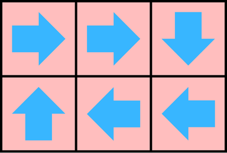
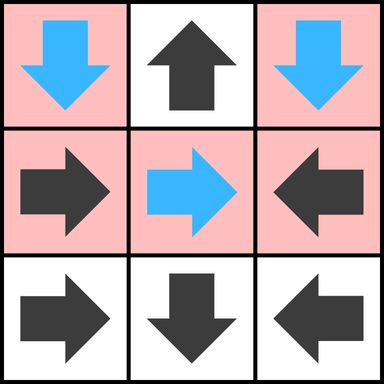

# C. Trapped in the Witch's Labyrinth

**time limit per test:** 3 seconds

**memory limit per test:** 256 megabytes

**input:** standard input

**output:** standard output

In the [fourth labor of Rostam](<https://www.gathertales.com/story/the-tale-of-the-haft-khan-seven-labors-of-rostam/sid-604>), the legendary hero from the [Shahnameh](<https://en.wikipedia.org/wiki/Shahnameh>), an old witch has created a magical maze to trap him. The maze is a rectangular grid consisting of $n$ rows and $m$ columns. Each cell in the maze points in a specific direction: up, down, left, or right. The witch has enchanted Rostam so that whenever he is in a cell, he will move to the next cell in the direction indicated by that cell.


If Rostam eventually exits the maze, he will be freed from the witch's enchantment and will defeat her. However, if he remains trapped within the maze forever, he will never escape.

The witch has not yet determined the directions for all the cells. She wants to assign directions to the unspecified cells in such a way that the number of starting cells from which Rostam will be trapped forever is maximized. Your task is to find the maximum number of starting cells which make Rostam trapped.

#### Input

The first line of the input contains an integer $t$ ($1 \leq t \leq 10^4$), the number of test cases.

For each test case:

- The first line contains two integers $n$ and $m$ ($1 \leq n, m \leq 1000$), representing the number of rows and columns in the maze.
- Each of the next $n$ lines contains a string of $m$ characters representing the directions in the maze. Each character is one of the following:

 - U (up)
 - D (down)
 - L (left)
 - R (right)
 - ? (unspecified direction)


It's guaranteed that the sum of $n \cdot m$ over all test cases is at most $10^6$.

#### Output

For each test case, print a single integer, the maximum number of starting cells from which Rostam will be trapped forever after assigning directions to the unspecified cells optimally.

#### Example

#### Input
```
3
3 3
UUU
L?R
DDD
2 3
???
???
3 3
?U?
R?L
RDL
```

#### Output
```
0
6
5
```

#### Note

In the first test case, all of the cells will be good no matter what you do.

In the second test case, if you assign the ?s like the picture below, all of the cells will be bad:





In the third test case, if you assign the ?s like the picture below, you will have $5$ bad cells (red-shaded cells):



