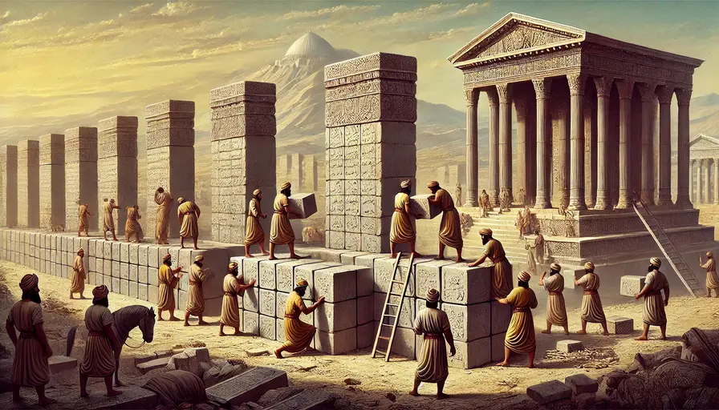

# D. Darius' Wisdom

**time limit per test:** 2 seconds

**memory limit per test:** 256 megabytes

**input:** standard input

**output:** standard output

[Darius the Great](<https://en.wikipedia.org/wiki/Darius_the_Great>) is constructing $n$ stone columns, each consisting of a base and between $0$, $1$, or $2$ inscription pieces stacked on top.

In each move, Darius can choose two columns $u$ and $v$ such that the difference in the number of inscriptions between these columns is exactly $1$, and transfer one inscription from the column with more inscriptions to the other one. It is guaranteed that at least one column contains exactly $1$ inscription.





Since beauty is the main pillar of historical buildings, Darius wants the columns to have ascending heights. To avoid excessive workers' efforts, he asks you to plan a sequence of at most $n$ moves to arrange the columns in non-decreasing order based on the number of inscriptions. Minimizing the number of moves is not required.

#### Input

The first line contains an integer $t$ — the number of test cases. ($1 \leq t \leq 3000$)

The first line of each test case contains an integer $n$ — the number of stone columns. ($1 \leq n \leq 2 \cdot 10^5$)

The second line contains $n$ integers $a_1, a_2, \ldots, a_n$, where $a_i \in \{0,1,2\}$ represents the initial number of inscriptions in the $i$-th column. It is guaranteed that at least one column has exactly $1$ inscription.

It is guaranteed that the sum of $n$ over all test cases does not exceed $2 \cdot 10^5$.

#### Output

For each test case, output an integer $k$ — the number of moves used to sort the columns. ($0 \leq k \leq n$)

Then, output $k$ lines, each containing two integers $u_i$ and $v_i$ ($1 \leq u_i, v_i \leq n$), representing the indices of the columns involved in the $i$-th move. During each move, it must hold that $|a_{u_i} - a_{v_i}| = 1$, and one inscription is transferred from the column with more inscriptions to the other.

It can be proven that a valid solution always exists under the given constraints.

#### Example

#### Input
```
3
4
0 2 0 1
3
1 2 0
6
0 1 1 2 2 2
```

#### Output
```
2
2 4
2 3
2
3 1
2 3
0
```

#### Note

Columns state in the first test case:

- Initial: $0, 2, 0, 1$
- After the first move: $0, 1, 0, 2$
- After the second move: $0, 0, 1, 2$

Columns state in the second test case:

- Initial: $1, 2, 0$
- After the first move: $0, 2, 1$
- After the second move: $0, 1, 2$

In the third test case, the column heights are already sorted in ascending order.
