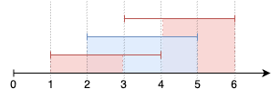
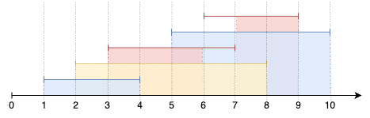
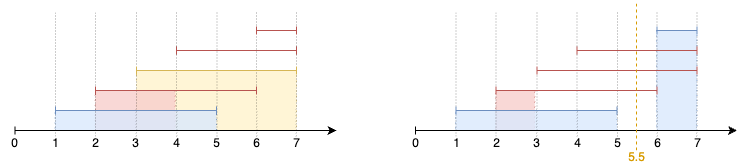

# G1. Simurgh's Watch (Easy Version)

**time limit per test:** 2 seconds

**memory limit per test:** 256 megabytes

**input:** standard input

**output:** standard output

The only difference between the two versions of the problem is whether overlaps are considered at all points or only at integer points.

The legendary [Simurgh](<https://www.eavartravel.com/blog/2023/11/3/140727/simurgh/>), a mythical bird, is responsible for keeping watch over vast lands, and for this purpose, she has enlisted $n$ vigilant warriors. Each warrior is alert during a specific time segment $[l_i, r_i]$, where $l_i$ is the start time (included) and $r_i$ is the end time (included), both positive integers.


One of Simurgh's trusted advisors, [Zal](<https://asia-archive.si.edu/learn/shahnama/zal-and-the-simurgh/>), is concerned that if multiple warriors are stationed at the same time and all wear the same color, the distinction between them might be lost, causing confusion in the watch. To prevent this, whenever multiple warriors are on guard at the same moment (which can be non-integer), there must be at least one color which is worn by exactly one warrior.

So the task is to determine the minimum number of colors required and assign a color $c_i$ to each warrior's segment $[l_i, r_i]$ such that, for every (real) time $t$ contained in at least one segment, there exists one color which belongs to exactly one segment containing $t$.

#### Input

The first line contains a single integer $t$ ($1 \leq t \leq 10^4$) — the number of test cases.

For each test case:

- The first line contains an integer $n$ ($1 \leq n \leq 2 \cdot 10^5$) — the number of warriors stationed by Simurgh.
- The next $n$ lines each contain two integers $l_i$ and $r_i$ ($1 \leq l_i \leq r_i \leq 10^9$) — the start and end times of the warrior's watch segment.

The sum of $n$ across all test cases does not exceed $2 \cdot 10^5$.

#### Output

For each test case:

- Output the minimum number of colors $k$ needed.
- Then, output a line of $n$ integers $c_i$ ($1 \leq c_i \leq k$), where each $c_i$ is the color assigned to the $i$-th warrior.

#### Example

#### Input
```
5
2
1 2
3 4
2
1 2
2 3
3
1 4
2 5
3 6
5
1 4
2 8
3 7
5 10
6 9
5
1 5
2 6
3 7
4 7
6 7
```

#### Output
```
1
1 1
2
1 2
2
1 2 1
3
2 3 1 2 1
3
2 1 3 1 1
```

#### Note

We can represent each warrior's watch segment as an interval on the X-axis;

In test case 1, we have two independent intervals, which can be colored with the same color.

In test case 2, point 2 is common to two intervals, meaning we cannot color them with the same color.

In test case 3, the intervals can be colored as shown below (intervals are colored with the selected color; areas are colored if this color occurs exactly once at this point in time):





In test case 4, the intervals can be colored as shown below:





In test case 5, the intervals can be colored as shown below. The image on the right demonstrates an example of incorrect coloring for this test case; there is no unique color at the moment $5.5$:



