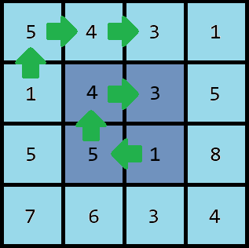

# D. I Love 1543

**time limit per test:** 2 seconds

**memory limit per test:** 256 megabytes

**input:** standard input

**output:** standard output

One morning, Polycarp woke up and realized that $1543$ is the most favorite number in his life.

The first thing that Polycarp saw that day as soon as he opened his eyes was a large wall carpet of size $n$ by $m$ cells; $n$ and $m$ are even integers. Each cell contains one of the digits from $0$ to $9$.

Polycarp became curious about how many times the number $1543$ would appear in all layers$^{\text{∗}}$ of the carpet when traversed clockwise.

$^{\text{∗}}$The first layer of a carpet of size $n \times m$ is defined as a closed strip of length $2 \cdot (n+m-2)$ and thickness of $1$ element, surrounding its outer part. Each subsequent layer is defined as the first layer of the carpet obtained by removing all previous layers from the original carpet.

#### Input

The first line of the input contains a single integer $t$ ($1 \leq t \leq 100$) — the number of test cases. The following lines describe the test cases.

The first line of each test case contains a pair of numbers $n$ and $m$ ($2 \leq n, m \leq 10^3$, $n, m$ — even integers).

This is followed by $n$ lines of length $m$, consisting of digits from $0$ to $9$ — the description of the carpet.

It is guaranteed that the sum of $n \cdot m$ across all test cases does not exceed $10^6$.

#### Output

For each test case, output a single number — the total number of times $1543$ appears in all layers of the carpet in the order of traversal clockwise.

#### Example

#### Input
```
8
2 4
1543
7777
2 4
7154
8903
2 4
3451
8888
2 2
54
13
2 2
51
43
2 6
432015
512034
4 4
5431
1435
5518
7634
6 4
5432
1152
4542
2432
2302
5942
```

#### Output
```
1
1
0
1
0
2
2
2
```

#### Note




 Occurrences of $1543$ in the seventh example. Different layers are colored in different colors.
