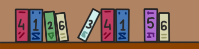

# G. Library of Magic

**time limit per test:** 2 seconds

**memory limit per test:** 256 megabytes

**input:** standard input

**output:** standard output

This is an interactive problem.

The Department of Supernatural Phenomena at the Oxenfurt Academy has opened the Library of Magic, which contains the works of the greatest sorcerers of Redania — $n$ ($3 \leq n \leq 10^{18}$) types of books, numbered from $1$ to $n$. Each book's type number is indicated on its spine. Moreover, each type of book is stored in the library in exactly two copies! And you have been appointed as the librarian.

One night, you wake up to a strange noise and see a creature leaving the building through a window. Three thick tomes of different colors were sticking out of the mysterious thief's backpack. Before you start searching for them, you decide to compute the numbers $a$, $b$, and $c$ written on the spines of these books. All three numbers are distinct.

So, you have an unordered set of tomes, which includes one tome with each of the pairwise distinct numbers $a$, $b$, and $c$, and two tomes for all numbers from $1$ to $n$, except for $a$, $b$, and $c$. You want to find these values $a$, $b$, and $c$.

Since you are not working in a simple library, but in the Library of Magic, you can only use one spell in the form of a query to check the presence of books in their place:

- "xor l r" — Bitwise XOR query with parameters $l$ and $r$. Let $k$ be the number of such tomes in the library whose numbers are greater than or equal to $l$ and less than or equal to $r$. You will receive the result of the computation $v_1 \oplus v_2 \oplus ... \oplus v_k$, where $v_1 ... v_k$ are the numbers on the spines of these tomes, and $\oplus$ denotes the operation of [bitwise exclusive OR](<http://tiny.cc/xor_wiki_eng>).

Since your magical abilities as a librarian are severely limited, you can make no more than $150$ queries.

#### Input

The first line of input contains an integer $t$ ($1 \le t \le 300$) — the number of test cases.

The first line of each test case contains a single integer $n$ ($3 \leq n \leq 10^{18}$) — the number of types of tomes.

#### Interaction

The interaction for each test case begins with reading the integer $n$.

Then you can make up to $150$ queries.

To make a query, output a string in the format "xor l r" (without quotes) ($1 \leq l \leq r \leq n$). After each query, read an integer — the answer to your query.

To report the answer, output a string in the format "ans a b c" (without quotes), where $a$, $b$, and $c$ are the numbers you found as the answer to the problem. You can output them in any order.

The interactor is not adaptive, which means that the answer is known before the participant makes queries and does not depend on the queries made by the participant.

After making $150$ queries, the answer to any other query will be $-1$. Upon receiving such an answer, terminate the program to receive a verdict of "WA" (Wrong answer).

After outputting a query, do not forget to output a newline and flush the output buffer. Otherwise, you will receive a verdict of "IL" (Idleness limit exceeded). To flush the buffer, use:

- fflush(stdout) or cout.flush() in C++;
- System.out.flush() in Java;
- flush(output) in Pascal;
- stdout.flush() in Python;
- refer to the documentation for other languages.

Hacks

To make a hack, use the following format.

The first line should contain a single integer $t$ ($1 \leq t \leq 300$) — the number of test cases.

The only line of each test case should contain four integers $n$, $a$, $b$, and $c$ ($3 \leq n \leq 10^{18}$, $1 \le a, b, c \le n$) — the number of books in the library and the numbers of the stolen tomes. The numbers $a$, $b$, and $c$ must be distinct.

#### Example

#### Input
```
2
6

0

2

3

5

3
```

#### Output
```
xor 1 1

xor 2 2

xor 3 3

xor 4 6

ans 2 3 5

ans 1 2 3
```

#### Note

In the first test case, the books in the library after the theft look like this:



Now consider the answers to the queries:

- For the query "xor 1 1", you receive the result $1 \oplus 1 = 0$. Two tomes satisfy the condition specified in the query — both with the number $1$.
- For the query "xor 2 2", you receive the result $2$, as only one tome satisfies the specified condition.
- For the query "xor 3 3", you receive the result $3$.
- For the query "xor 4 6", you receive the result $4 \oplus 6 \oplus 4 \oplus 5 \oplus 6 = 5$.

In the second test case, there are only $3$ types of books, and it is easy to guess that the missing ones have the numbers $1$, $2$, and $3$.
