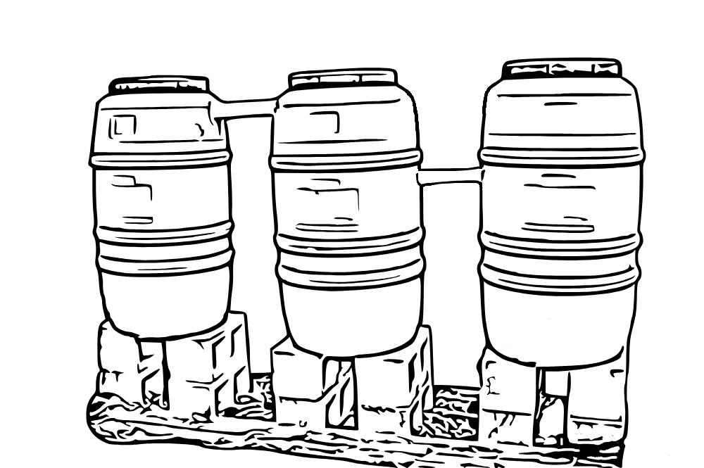
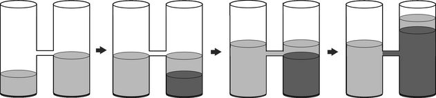

# E. Barrels

**time limit per test:** 2 seconds

**memory limit per test:** 512 megabytes

**input:** standard input

**output:** standard output

Suppose you have $n$ water barrels standing in a row, numbered from $1$ to $n$.

All barrels are equal and have a bottom area equal to one unit, so the volume of the water inside a barrel is equal to the height of the water column. Initially, the $i$-th barrel has $v_i$ units of water.

Adjacent barrels are connected by pipes. In other words, for each $i$ from $1$ to $n - 1$, barrels $i$ and $i + 1$ are connected by a single horizontal pipe at height $h_i$. The widths of the pipes are negligible. These pipes allow water to flow between barrels.





Now you want to play with barrels. Your plan is to maximize the volume of the water in the first barrel by throwing clay into barrels. In one step, you can choose any barrel and throw one unit of clay into it. One unit of clay has the same volume as one unit of water. Clay is heavier than water and doesn't mix with it, so it falls to the bottom of the barrel, distributing evenly.

Clay has a sticky structure, so it seals pipes if the clay column is high enough. More formally, suppose the pipe is at height $h$. If the height of the clay column is also $\boldsymbol{h}$ (or lower), the pipe is working. But the moment you add more clay into the barrel, the pipe becomes sealed instantly, preventing any water from moving between barrels.

You have a mountain of clay, so you can repeat the step described above any number of times. However, between the steps, you have to wait until the water reaches the new equilibrium.

What is the maximum water volume you can collect in the first barrel?

Assume that the barrels are high enough, so the water doesn't overflow, and the pipe widths are negligible.

#### Input

The first line contains a single integer $n$ ($2 \le n \le 2 \cdot 10^5$) — the number of barrels.

The second line contains $n$ integers $v_1, v_2, \dots, v_n$ ($0 \le v_i \le 10^6$), where $v_i$ is the initial water volume in the $i$-th barrel.

The third line contains $n - 1$ integers $h_1, h_2, \dots, h_{n - 1}$ ($1 \le h_i \le 10^6$), where $h_i$ is the height of the pipe between the $i$-th and the $(i + 1)$-st barrel.

Additional constraint on the input: the given water heights are in an equilibrium.

#### Output

Print a single number — the maximum volume of water in the first barrel. Your answer is considered correct if its absolute or relative error does not exceed $10^{-6}$.

Formally, let your answer be $a$, and the jury's answer be $b$. Your answer is accepted if and only if $\frac{|a - b|}{\max{(1, |b|)}} \le 10^{-6}$.

#### Examples

#### Input
```
2
1 2
2
```

#### Output
```
2.500000000000000
```

#### Input
```
3
3 0 0
6 9
```

#### Output
```
3.000000000000000
```

#### Input
```
5
10 0 0 0 5
11 1 2 5
```

#### Output
```
11.916666666666667
```

#### Note

An optimal strategy for the first example is shown in the picture below:



