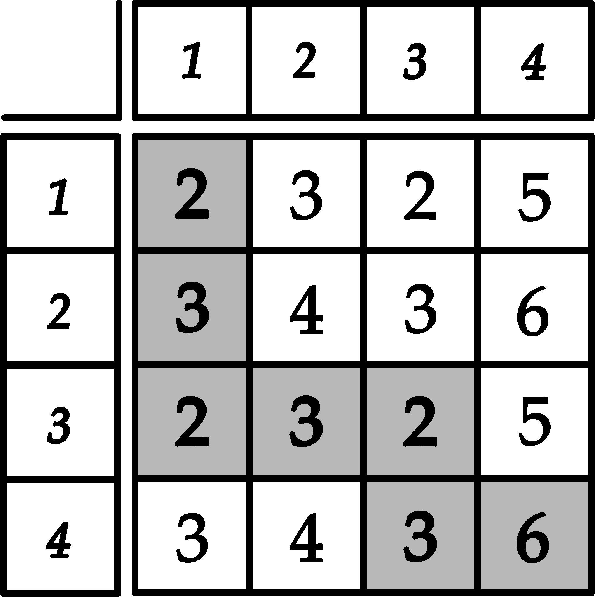

# K. Grid Walk

**time limit per test:** 2 seconds

**memory limit per test:** 512 megabytes

**input:** standard input

**output:** standard output

You have an $n \times n$ grid and two integers $a$ and $b$. Both the rows and the columns are numbered from $1$ to $n$. Let's denote the cell at the intersection of the $i$-th row and the $j$-th column as $(i, j)$.

You are standing in the cell $(1, 1)$ and want to move into the cell $(n, n)$.

Suppose you are in the cell $(i, j)$; in one step, you can move either into the cell $(i, j + 1)$ or into the cell $(i + 1, j)$ if the corresponding cells exist.

Let's define the cost of the cell $(i, j)$ as $c(i, j) = \gcd(i, a) + \gcd(j, b)$ (here, $\gcd(x,y)$ denotes the greatest common divisor of $x$ and $y$). The cost of the route from $(1, 1)$ to $(n, n)$ is the sum of costs of the visited cells (including the starting cell and the finishing cell).





Find the route with minimum possible cost and print its cost.

#### Input

The only line contains three integers $n$, $a$, and $b$ ($2 \le n \le 10^6$; $1 \le a, b \le 10^6$).

#### Output

Print one integer — the cost of the cheapest route from $(1, 1)$ to $(n, n)$.

#### Examples

#### Input
```
4 2 4
```

#### Output
```
21
```

#### Input
```
10 210 420
```

#### Output
```
125
```

#### Note

The first example is described in the picture above.
