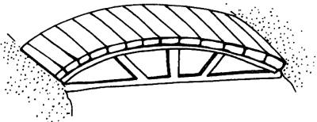

# L. Bridge Renovation

**time limit per test:** 2 seconds

**memory limit per test:** 512 megabytes

**input:** standard input

**output:** standard output

Recently, Monocarp started working as a director of a park located near his house. The park is quite large, so it even has a small river splitting it into several zones. Several bridges are built across this river. Three of these bridges are especially old and need to be repaired.

All three bridges have the same length but differ in width. Their widths are $18$, $21$ and $25$ units, respectively.

During the park renovation process, Monocarp has to replace the old planks that served as the surface of the bridges with the new ones.





Planks are sold with a standard length of $60$ units. Monocarp already knows that he needs $n$ planks for each bridge. But since the bridges have different widths, he needs $n$ planks of length $18$ for the first bridge, $n$ planks of length $21$ for the second one, and $n$ planks of length $25$ for the last one.

Workers in charge of renovation have no problem with cutting planks into parts but refuse to join planks, since it creates weak spots and looks ugly.

Monocarp wants to buy as few planks as possible but struggles to calculate the required number of planks. Can you help him?

#### Input

The first and only line contains a single integer $n$ ($1 \le n \le 1000$) — the number of planks required for each of the three bridges.

#### Output

Print a single integer — the minimum number of planks of standard length ($60$ units) Monocarp needs to cover all three bridges if the planks can be cut into parts.

#### Examples

#### Input
```
1
```

#### Output
```
2
```

#### Input
```
3
```

#### Output
```
4
```

#### Input
```
1000
```

#### Output
```
1167
```

#### Note

In the first example, it is possible to cut one plank of length $60$ into three planks with lengths $25$, $18$ and $17$, and cut another plank of length $60$ into two planks with lengths $39$ and $21$. That way, Monocarp will have all the required planks.
