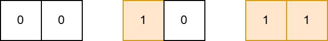
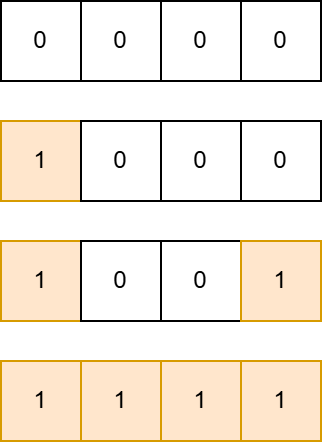

# B. Paint a Strip

**time limit per test:** 1 second

**memory limit per test:** 256 megabytes

**input:** standard input

**output:** standard output

You have an array of zeros $a_1, a_2, \ldots, a_n$ of length $n$.

You can perform two types of operations on it:

- Choose an index $i$ such that $1 \le i \le n$ and $a_i = 0$, and assign $1$ to $a_i$;
- Choose a pair of indices $l$ and $r$ such that $1 \le l \le r \le n$, $a_l = 1$, $a_r = 1$, $a_l + \ldots + a_r \ge \lceil\frac{r - l + 1}{2}\rceil$, and assign $1$ to $a_i$ for all $l \le i \le r$.

What is the minimum number of operations of the first type needed to make all elements of the array equal to one?

#### Input

Each test contains multiple test cases. The first line contains the number of test cases $t$ ($1 \le t \le 10^4$). The description of the test cases follows.

The only line of each test case contains one integer $n$ ($1 \le n \le 10^5$) — the length of the array.

Note that there is no limit on the sum of $n$ over all test cases.

#### Output

For each test case, print one integer — the minimum number of needed operations of first type.

#### Example

#### Input
```
4
1
2
4
20
```

#### Output
```
1
2
2
4
```

#### Note

In the first test case, you can perform an operation of the $1$st type with $i = 1$.

In the second test case, you can perform the following sequence of operations:

- Operation of $1$st type, $i = 1$. After performing this operation, the array will look like this: $[1, 0]$.
- Operation of $1$st type, $i = 2$. After performing this operation, the array will look like this: $[1, 1]$.
 The sequence of operations in the second test case




In the third test case, you can perform the following sequence of operations:

- Operation of $1$st type, $i = 1$. After performing this operation, the array will look like this: $[1, 0, 0, 0]$.
- Operation of $1$st type, $i = 4$. After performing this operation, the array will look like this: $[1, 0, 0, 1]$.
- Operation of $2$nd type, $l = 1$, $r = 4$. On this segment, $a_l + \ldots + a_r = a_1 + a_2 + a_3 + a_4 = 2$, which is not less than $\lceil\frac{r - l + 1}{2}\rceil = 2$. After performing this operation, the array will look like this: $[1, 1, 1, 1]$.
 The sequence of operations in the third test case


