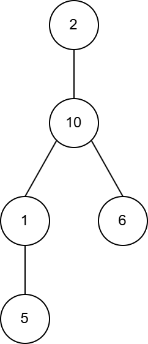
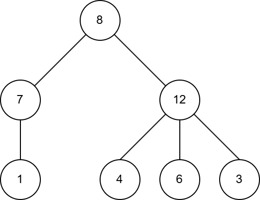

# D. Non Prime Tree

**time limit per test:** 2 seconds

**memory limit per test:** 256 megabytes

**input:** standard input

**output:** standard output

You are given a tree with $n$ vertices.

You need to construct an array $a_1, a_2, \ldots, a_n$ of length $n$, consisting of unique integers from $1$ to $2 \cdot n$, and such that for each edge $u_i \leftrightarrow v_i$ of the tree, the value $|a_{u_i} - a_{v_i}|$ is not a prime number.

Find any array that satisfies these conditions, or report that there is no such array.

#### Input

Each test contains multiple test cases. The first line contains the number of test cases $t$ ($1 \le t \le 10^4$). The description of the test cases follows.

The first line of each test case contains a single integer $n$ ($2 \le n \le 2 \cdot 10^5$) — the number of vertices in the tree.

The next $n - 1$ lines contain the edges of the tree, one edge per line. The $i$-th line contains two integers $u_i$ and $v_i$ ($1 \le u_i, v_i \le n$; $u_i \neq v_i$), denoting the edge between the nodes $u_i$ and $v_i$.

It's guaranteed that the given edges form a tree.

It is guaranteed that the sum of $n$ over all test cases does not exceed $2 \cdot 10 ^ 5$.

#### Output

For each test case, if an array that satisfies the conditions exists, print its elements $a_1, a_2, \ldots, a_n$. Otherwise, print $-1$.

#### Example

#### Input
```
2
5
1 2
2 3
2 4
3 5
7
1 2
1 3
2 4
3 5
3 6
3 7
```

#### Output
```
2 10 1 6 5 
8 7 12 1 4 6 3 
```

#### Note

The possible answers are shown below. Instead of the vertex numbers, the corresponding elements of the array $a$ are written in them.
 The image of the tree in the first test case



 The image of the tree in the second test case


