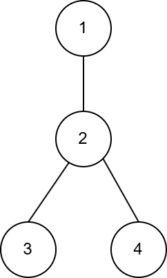
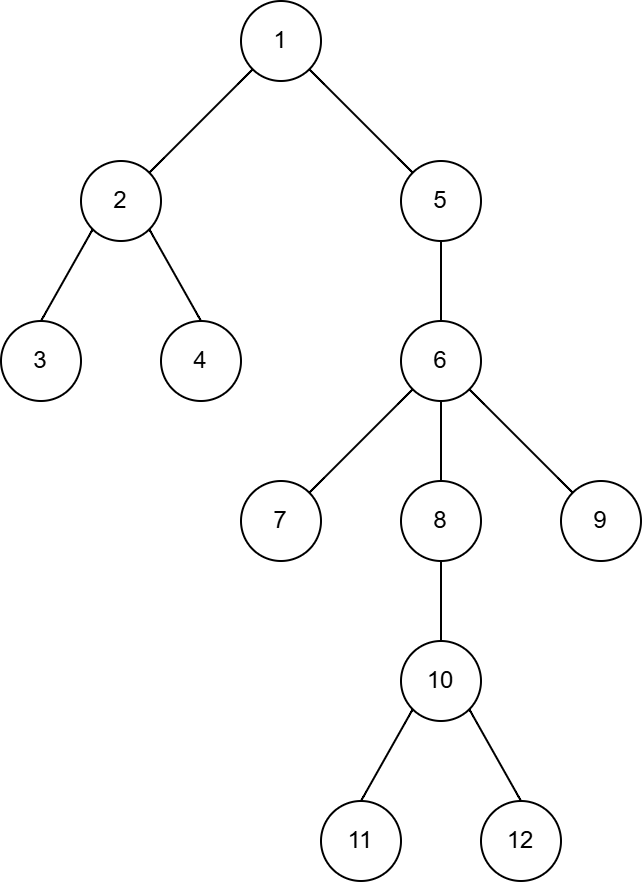

# E. Control of Randomness

**time limit per test:** 2 seconds

**memory limit per test:** 256 megabytes

**input:** standard input

**output:** standard output

You are given a tree with $n$ vertices.

Let's place a robot in some vertex $v \ne 1$, and suppose we initially have $p$ coins. Consider the following process, where in the $i$-th step (starting from $i = 1$):

- If $i$ is odd, the robot moves to an adjacent vertex in the direction of vertex $1$;
- Else, $i$ is even. You can either pay one coin (if there are some left) and then the robot moves to an adjacent vertex in the direction of vertex $1$, or not pay, and then the robot moves to an adjacent vertex chosen uniformly at random.

The process stops as soon as the robot reaches vertex $1$. Let $f(v, p)$ be the minimum possible expected number of steps in the process above if we spend our coins optimally.

Answer $q$ queries, in the $i$-th of which you have to find the value of $f(v_i, p_i)$, modulo$^{\text{∗}}$ $998\,244\,353$.

$^{\text{∗}}$ Formally, let $M = 998\,244\,353$. It can be shown that the answer can be expressed as an irreducible fraction $\frac{p}{q}$, where $p$ and $q$ are integers and $q \not \equiv 0 \pmod{M}$. Output the integer equal to $p \cdot q^{-1} \bmod M$. In other words, output such an integer $x$ that $0 \le x \lt M$ and $x \cdot q \equiv p \pmod{M}$.

#### Input

Each test contains multiple test cases. The first line contains the number of test cases $t$ ($1 \le t \le 10^3$). The description of the test cases follows.

The first line of each test case contains two integers $n$ and $q$ ($2 \le n \le 2 \cdot 10^3$; $1 \le q \le 2 \cdot 10^3$) — the number of vertices in the tree and the number of queries.

The next $n - 1$ lines contain the edges of the tree, one edge per line. The $i$-th line contains two integers $u_i$ and $v_i$ ($1 \le u_i, v_i \le n$; $u_i \neq v_i$), denoting the edge between the nodes $u_i$ and $v_i$.

The next $q$ lines contain two integers $v_i$ and $p_i$ ($2 \le v_i \le n$; $0 \le p_i \le n$).

It's guaranteed that the given edges form a tree.

It is guaranteed that the sum of $n$ over all test cases does not exceed $2 \cdot 10 ^ 3$.

It is guaranteed that the sum of $q$ over all test cases does not exceed $2 \cdot 10 ^ 3$.

#### Output

For each test case, print $q$ integers: the values of $f(v_i, p_i)$ modulo $998\,244\,353$.

Formally, let $M = 998\,244\,353$. It can be shown that the answer can be expressed as an irreducible fraction $\frac{p}{q}$, where $p$ and $q$ are integers and $q \not \equiv 0 \pmod{M}$. Output the integer equal to $p \cdot q^{-1} \bmod M$. In other words, output such an integer $x$ that $0 \le x \lt M$ and $x \cdot q \equiv p \pmod{M}$.

#### Example

#### Input
```
2
4 4
1 2
2 3
2 4
2 0
3 0
4 0
3 1
12 10
1 2
2 3
2 4
1 5
5 6
6 7
6 8
6 9
8 10
10 11
10 12
6 0
9 0
10 0
11 0
3 1
7 1
10 1
12 1
12 2
11 12
```

#### Output
```
1
6
6
2
4
9
8
15
2
3
6
9
5
5
```

#### Note

The tree in the first test case:





In the first query, the expected value is equal to $1$, since the robot starts moving from vertex $2$ to vertex $1$ in the first step and the process stops.

Let's calculate the expected value in the second query ($x$ is the number of steps):

- $P(x \lt 2) = 0$, the distance to vertex $1$ is $2$ and the robot cannot reach it in fewer steps.
- $P(x = 2) = \frac{1}{3}$, since there is only one sequence of steps leading to $x = 2$. This is $3 \rightarrow_{1} 2 \rightarrow_{0.33} 1$ with probability $1 \cdot \frac{1}{3}$.
- $P(x \bmod 2 = 1) = 0$, since the robot can reach vertex $1$ by only taking an even number of steps.
- $P(x = 4) = \frac{2}{9}$: possible paths $3 \rightarrow_{1} 2 \rightarrow_{0.67} [3, 4] \rightarrow_{1} 2 \rightarrow_{0.33} 1$.
- $P(x = 6) = \frac{4}{27}$: possible paths $3 \rightarrow_{1} 2 \rightarrow_{0.67} [3, 4] \rightarrow_{1} 2 \rightarrow_{0.67} [3, 4] \rightarrow_{1} 2 \rightarrow_{0.33} 1$.
- $P(x = i \cdot 2) = \frac{2^{i - 1}}{3^i}$ in the general case.

As a result, $f(v, p) = \sum\limits_{i=1}^{\infty}{i \cdot 2 \cdot \frac{2^{i - 1}}{3^i}} = 6$.

The tree in the second test case:



